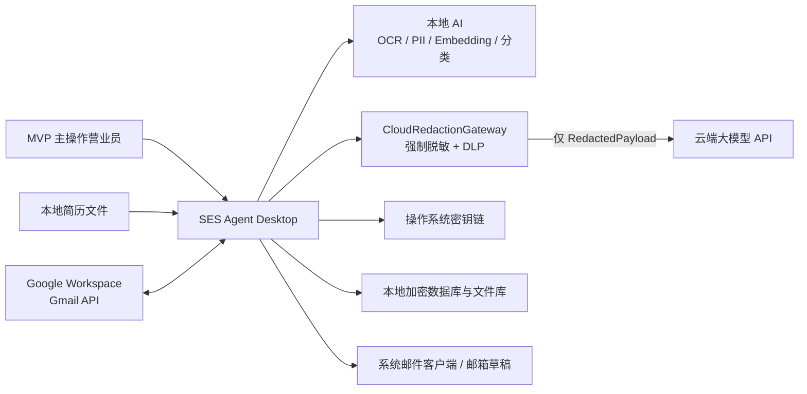
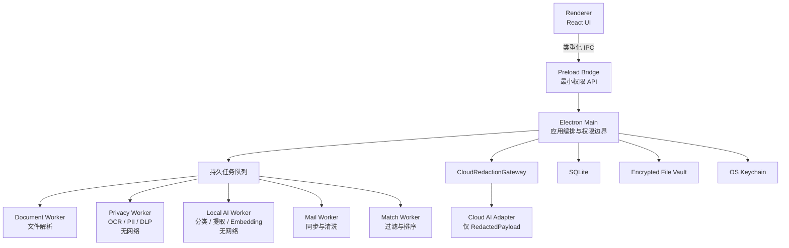
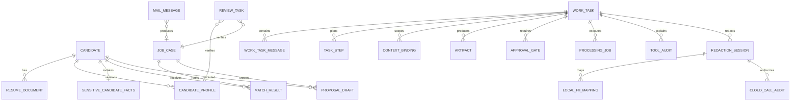
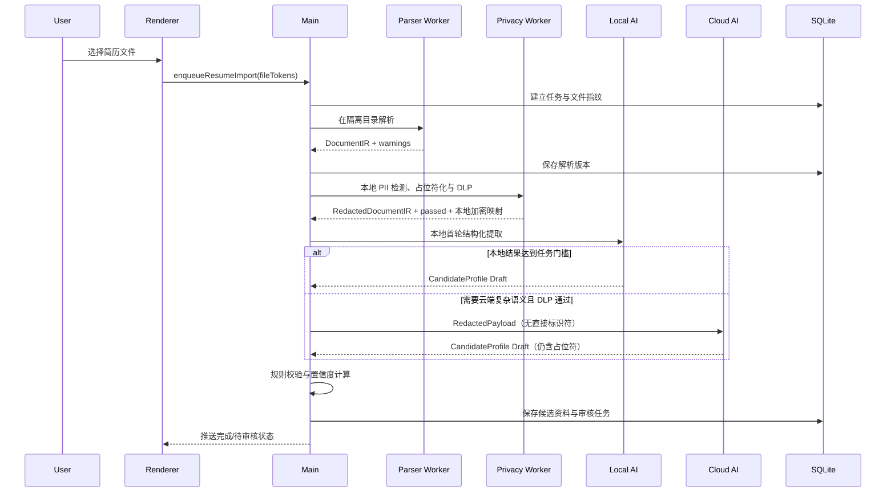

# SES Agent Desktop 技术架构

<!-- ses-current-state package=0.1.0 schema=43 -->

> 版本：v0.7
> 目标：无需业务服务器即可交付安全、可恢复、可演进的桌面 MVP

## 1. 架构原则

1. **本地优先**：原始文件、结构化资料、案件与反馈默认保存在用户设备。
2. **确定性解析与 AI 理解分离**：JavaScript 负责读取文件，大模型负责语义提取，程序负责校验。
3. **不信任输入内容**：简历、邮件和附件都视为不可信数据，不允许它们直接触发工具或系统操作。
4. **人工控制外发**：提案生成、附件脱敏和邮件外发必须分阶段，并设置不可绕过的确认门。
5. **任务可恢复**：文件、邮件、模型调用和索引任务都进入持久队列。
6. **接口可替换**：存储、模型、邮箱、解析器和匹配器通过内部接口隔离，为团队版迁移留出边界。
7. **先单机验证，后增加同步**：不在 MVP 中提前建设账号、多租户和云端协作。
8. **用户任务与执行作业分离**：`WorkTask` 保存用户意图、上下文、步骤、产物和审批；`ProcessingJob` 只表示可重试的后台执行单元。
9. **受限编排而非通用 Agent**：自然语言先转换为枚举的任务类型，再调用领域 API；模型无权自由选择工具或扩大数据范围。
10. **云端零直接标识符**：任何 Cloud AI 调用必须通过本地脱敏与 DLP 复检；用户确认也不能绕过，校验失败时关闭调用而不是降级上传原文。
11. **本地优先分层推理**：原始个人数据只进入无网络本地处理链；本地模型负责隐私关键和可验证任务，云端只处理脱敏后的复杂语义任务。
12. **平台顺序明确、领域逻辑共用**：首发 macOS，试点 Go 后交付 Windows；OCR、密钥、签名、安装和系统集成通过 Platform Port 隔离，领域层和数据契约不分叉。
13. **邮箱 Provider 冻结**：MVP 只实现 Google Workspace Gmail API；不为 Microsoft 365 或通用 IMAP 增加首发分支。

## 2. 系统上下文



第一阶段没有业务服务器。唯一的外部网络依赖是用户配置的邮箱、受控模型下载和云端模型服务；本地模型正常推理时禁止远程加载。应用必须允许用户在未连接邮箱或云端模型时继续使用本地资料、隐私处理、搜索和人工编辑。

## 3. 桌面进程模型



### 3.1 Renderer

职责：

- 展示案件、候选人、审核任务、匹配结果和设置。
- 收集用户输入并调用明确的领域 API。
- 不直接访问 Node.js、文件系统、数据库、密钥链或任意网络地址。

安全配置：

- `nodeIntegration: false`
- `contextIsolation: true`
- `sandbox: true`
- 严格 Content Security Policy
- 禁止任意导航、新窗口和远程代码执行

Renderer 的 `⌘/Ctrl+K` 业务命令面板只在内存中过滤预先构造的允许动作，不把搜索词写入数据库、日志或网络。命令本身不是任意 Tool Router：它只能触发已有的类型化 UI/IPC 入口，Main 仍独立执行 Schema、范围、预览哈希、PII/DLP 与审批校验。文件选择、手工案件和 Google 设置使用一次性请求，由目标组件消费后清除，避免 React 页面重新挂载时重复产生系统对话框或敏感操作。

任务详情的主结果、证据和管控视图共享同一份已加载 `WorkTaskSnapshot`。Renderer 只做确定性派生：证据视图组合匿名 Match Rank、非敏感 Source Label、Algorithm/Policy/Result Hash、Artifact 和 ToolAudit；管控视图组合 Data Scope、Cloud/PII 边界、ApprovalGate 与 ProcessingJob Replay Policy。切换视图不会再次查询数据库、运行本地模型或发起网络请求，也不会把文件名、路径、姓名和联系方式复制到展示状态。任何执行与权限判断仍以 Main 对 Scope、Schema、Preview Hash、PII/DLP 和批准哈希的复检为准。

### 3.2 Preload Bridge

只暴露业务级方法，例如：

```ts
interface DesktopApi {
  createWorkTask(input: CreateWorkTaskInput): Promise<WorkTaskId>
  appendWorkTaskMessage(taskId: WorkTaskId, input: WorkTaskMessageInput): Promise<void>
  cancelWorkTask(taskId: WorkTaskId): Promise<void>
  listWorkTasks(query: WorkTaskQuery): Promise<WorkTaskPage>
  chooseResumeFiles(): Promise<FileToken[]>
  enqueueResumeImport(tokens: FileToken[]): Promise<JobId[]>
  listCandidates(query: CandidateQuery): Promise<CandidatePage>
  approveReview(taskId: string, patch: ReviewPatch): Promise<void>
  createProposalDraft(input: ProposalInput): Promise<ProposalId>
}
```

禁止直接暴露 `ipcRenderer.send`、文件路径、Shell 命令或任意 SQL。每个 IPC handler 必须校验发送者、参数 Schema 和权限，返回值也必须经过运行时 Schema 校验。`FileToken` 是 Main 内部的短期能力引用，包含过期时间、用途和单次/多次使用限制，不向 Renderer 返回真实路径。

### 3.3 Electron Main

职责：

- 应用生命周期、窗口与更新管理。
- IPC 鉴权和领域用例编排。
- 数据库事务与迁移。
- 密钥链访问与加解密。
- 任务入队、取消、重试和恢复。
- 调度独立 Worker，避免重型任务阻塞界面。

### 3.4 Workers

文档解析、OCR/视觉处理、Embedding 和批量匹配不能在 Renderer 中执行。纯计算、不处理原始不可信字节的工作可使用 Node Worker Threads；Excel、Word、PDF、OCR 等第三方解析器必须使用独立 Child Process 或等价的最小权限辅助进程。Worker Thread/Child Process 不得被文档称为完整安全沙箱；它们首先是崩溃、资源和权限隔离边界。

解析辅助进程必须：

- 最大文件大小
- 最大解压大小和条目数
- CPU/执行超时
- 内存上限或并发上限
- 临时目录隔离
- 可取消任务
- 不注入邮箱 Token、模型 API Key、数据库密钥或备份密钥
- 默认无网络；只读取隔离目录中指定的单个输入
- 本地模型推理时禁止从远程 Hub 自动加载模型；模型安装/升级是独立、可审计且校验哈希的流程
- 只能通过限定大小的结构化 IPC 返回 JSON/Buffer
- 被终止、崩溃或应用重启后都能清理临时文件

## 4. 推荐技术栈

| 层 | 技术 | 选择理由 |
|---|---|---|
| 桌面容器 | Electron | React/TypeScript 复用，成熟的打包与系统集成 |
| UI | React + TypeScript + Vite | 桌面单页界面，无 SSR 需求 |
| 状态管理 | TanStack Query + 轻量本地 UI Store | 服务状态和界面状态分离 |
| Schema | Zod + JSON Schema | IPC、配置、模型输出统一校验 |
| 数据库 | SQLCipher-compatible SQLite | 保留 SQLite 的单机事务与查询能力，同时对数据库页和 WAL 加密；原生模块与签名必须在 Spike 验证 |
| 查询层 | 明确 Repository + SQL migrations | 避免 ORM 隐藏复杂查询与迁移行为 |
| Excel | SheetJS | 覆盖 `.xls/.xlsx/.xlsb` 等 SES 常见格式 |
| PDF | PDF.js | 本地文本、页面和位置提取 |
| Word | Mammoth | `.docx` 段落与表格提取 |
| 云端 AI | Cloud Provider Adapter（首发未启用、无默认 Provider） | 未来只处理通过脱敏和 DLP 的复杂结构化语义与日文生成；启用前需独立安全和质量评审 |
| 本地 OCR Port | macOS：Vision Framework；Windows：固定 Tesseract WASM + 日英离线资源 | 领域层只依赖 `LocalOcrPort`；扫描 PDF/图片先在设备上识别，不上传原图；Windows 通过 AppContainer 零网络 Capability 运行 |
| 本地轻量 AI | Transformers.js/ONNX 候选 | PII/NER、分类与 Embedding；固定本地模型路径并关闭远程模型加载 |
| 本地小型 LLM | `llama.cpp` GGUF 辅助进程候选 | 可选的首轮提取/摘要；Apple Silicon 支持良好，但必须经过日文质量、内存和打包 Spike |
| 本地 Embedding | Transformers.js + `multilingual-e5-small` 候选模型 | 不额外发送候选人全文，可离线建立语义索引；上线前必须用日文 SES 样本验证 |
| 密钥 | Electron `safeStorage` 异步 API + 系统 Keychain 语义 | 只保护小型主密钥 Blob；数据库和文件使用派生密钥加密 |
| 日志 | 结构化本地日志 + 字段脱敏 | 支持诊断，禁止记录原始个人信息 |
| 打包 | electron-builder 或 Electron Forge | 代码签名、安装包和自动更新 |

首个技术 Spike 必须验证老式 `.xls`、日文 PDF、本地 OCR、日文 PII 检测、本地 Embedding 和可选小型 LLM 在目标 Mac 上的质量、内存、速度与打包体积。PII/DLP 不允许切换为外部服务；Embedding 或小型 LLM 质量不足时可以停留在本地规则/人工流程，或把已脱敏文本发送到经批准的云端 Provider。

Windows 日本語 NER 候选审计（2026-07-20）暂不进入发行包。`jiting/xlm-roberta-ner-japanese_onnx` 具备 Transformers.js ONNX 与 MIT 标识，但量化模型约 279 MB，基础模型使用日文 Wikipedia NER 数据；模型卡验证 F1 不能替代 SES 简历姓名召回。常见 `distilbert-base-multilingual-cased-ner-hrl` 的训练语言不含日文。当前 Windows 明确显示“项标签/规则 + HR 必确认”；隐私核心 API 内部仍以 `personNameReviewCompleted=true` 表示 Main 已完成当前内容的复核阶段，但 Renderer 不再能提交该字段。只有 Main 签发且绑定正文、脱敏预览、Actor、Endpoint、Gate 和有效期的一次性 Review Ticket 经原生确认后，才会在第二次脱敏中设置内部完成状态。只有真实 SES 姓名集达到单独 Recall/误报/资源门并完成许可证归属复核后，才允许把状态改成已验证日本語 NER。

## 5. 代码模块边界

建议采用单仓库结构：

```text
apps/desktop/
  src/main/             Electron Main 与用例编排
  src/preload/          类型化、最小权限 Bridge
  src/renderer/         React UI
packages/domain/        领域实体、状态机、业务规则
packages/application/   WorkTask 编排与 Import、Review、Match、Proposal 用例
packages/tasks/         受限意图路由、任务步骤、上下文绑定、产物与工具审计
packages/parsers/       Excel、PDF、DOCX 与 DocumentIR
packages/privacy/       PII 检测、占位符映射、图像遮盖、DLP 与 CloudRedactionGateway
packages/local-ai/      OCR、NER、分类、Embedding 与可选小型 LLM Runtime
packages/ai/            Cloud Provider、Prompt、RedactedPayload Schema、Eval
packages/mail/          Google Workspace OAuth、Gmail API 同步与草稿适配器
packages/matching/      过滤、召回、排序、解释
packages/platform/      LocalOcrPort、KeyProtectionPort、Installer/Update 与平台能力适配
packages/persistence/   SQLite、迁移、加密仓库
packages/security/      Keychain、脱敏、审计、输入限制
packages/shared/        Result、错误码、日志字段、类型
tests/fixtures/         脱敏样本与评测真值
```

依赖方向：

```text
Renderer → Application → Domain
Main     → Application → Domain
Adapters → Application ports
Domain 不依赖 Electron、数据库、模型 SDK 或邮箱 SDK
```

## 6. 核心数据模型

| 实体 | 作用 | 关键字段 |
|---|---|---|
| Candidate | 候选人主记录 | 状态、显示名、可用时间、更新时间 |
| ResumeDocument | 原始简历版本 | 文件哈希、格式、加密路径、解析版本 |
| CandidateProfile | 经确认的结构化资料 | 技能、项目、语言、费率、来源引用、确认时间、有效期 |
| CandidateProjectExperience | 候选人的确认项目段 | 标题、期间、角色、技术、担当摘要、来源引用；独立 ID 与向量缓存 |
| SensitiveCandidateFacts | 按政策单独隔离的高风险字段 | 年龄/国籍、用途、策略版本、权限与来源引用 |
| MailMessage | 邮件本地镜像 | Provider ID、Message-ID、线程、摘要 |
| JobCaseSource | 进入案件审核前的统一脱敏来源 | Gmail/手动/未来 CRM 类型、Provider 引用、脱敏件名/正文、RedactionSession、警告 |
| JobCaseExtraction | 待人工确认的案件字段草稿 | 来源 ID、抽取版本、字段值、置信度、证据、警告 |
| JobCase | 结构化案件 | 技能、单价/税别、精算幅、支付条件、契约/商流、面谈、地点、远程、语言、起止时间、工时 |
| JobCaseLifecycle | 案件当前可用性 | active/archived、理由、处理人、时间 |
| JobCaseEvent | 案件治理事件 | archived/restored/revision-opened、理由、Review Revision、处理人 |
| GmailMessageTombstone | 删除后防止相同邮件复活 | Workspace 账号、Message ID、删除时间、固定原因 |
| MatchResult | 某案件的候选人排序 | 分数、依据、风险、算法版本 |
| ProposalDraft | 提案草稿 | 模板版本、正文、脱敏字段/项目附件、确认状态与内容哈希 |
| ProposalDelivery | 提案离开生成流程后的状态 | 导出记录、收件人摘要、内容哈希、固定 `exported-not-sent` |
| ProposalFollowUpEvent | 导出后的本地人工跟进 | 顺序 Revision、发送/回复/面谈/终态、发生日期、备注、Main 绑定 Actor、`cloudEligible=false` |
| LocalApplicationPreferences | 本机显示偏好 | `ja-JP/zh-CN`、乐观 Revision、更新时间、`cloudEligible=false`；不包含业务数据或用户文本 |
| ReviewTask | 人工审核任务 | 类型、原因、差异、处理人、状态 |
| WorkTask | 用户可见的持续业务任务 | 类型、状态、标题、数据策略、创建人、等待原因 |
| WorkTaskMessage | 用户和系统的持续上下文 | 角色、结构化内容、附件引用、时间 |
| TaskStep | 任务计划与执行步骤 | 顺序、领域用例、状态、输入/输出引用、重试策略 |
| ContextBinding | 任务允许读取的数据范围 | 对象类型、对象 ID、版本、授权来源、过期时间 |
| Artifact | 任务产物 | 类型、加密路径/对象引用、哈希、版本、可导出性 |
| ApprovalGate | 不可绕过的人工确认门 | 类型、绑定内容哈希、状态、确认人、失效原因 |
| ToolAudit | 任务用例调用证据 | 计划、允许原因、实际执行、证据、阻止和审批状态 |
| ProcessingJob | 后台持久处理作业 | 幂等键、进度、重试、错误码、所属任务步骤 |
| AuditEvent | 敏感操作审计 | 操作类型、对象、时间、结果 |
| DataDeletionReport | 删除可验证报告 | 主记录、文件、索引、缓存、备份处理状态 |
| RecoveryEvent | 本机备份/恢复审计 | backup-created/restore-completed/restore-failed、Backup ID、包哈希、快照数据修订号、摘要、时间 |
| LocalDataRevision | 备份新鲜度的本地单调标记 | 修订号、最后业务变化时间；不包含正文或个人信息 |
| RecoveryReminderPreference | 用户明确延期的本地状态 | 延期截止时间、延期时的数据修订号；不保存路径或密码 |
| RedactionSession | 一次本地脱敏执行 | 来源版本、策略版本、字段类型/数量、状态、载荷哈希 |
| LocalPiiMapping | 仅本地保存的占位符映射 | 会话、占位符、加密原值、来源位置、用途、过期时间 |
| CloudCallAudit | 云端调用隐私证据 | 脱敏会话、DLP 结果、Provider、任务类型、输入哈希、质量报告哈希、可选专家 Attestation 哈希、Review Ticket 哈希、硬门策略版本与原因码 |
| LocalModelManifest | 本地模型供应链与能力记录 | 模型/任务、版本、哈希、来源、运行时、资源预算、评测版本 |

主要关系：



设计规则：

- 原始解析结果与用户确认结果分开保存。
- 任何模型输出都记录 `provider/model/promptVersion/schemaVersion`。
- 用户任务、处理作业和人工审核使用独立实体，不共用一个含混状态字段。
- 每个 `ApprovalGate` 绑定收件人、正文和附件集合的内容哈希；任一内容变更都使旧确认失效。
- 候选人的每次简历更新产生新版本，不覆盖历史来源。
- 删除候选人时必须级联处理原文件、结构化资料、敏感字段、派生文本、Embedding、缓存和备份标记。
- `LocalPiiMapping` 与任务/来源版本绑定并单独加密；它不能出现在 CloudCallAudit、日志、模型缓存或崩溃报告中。
- `CloudCallAudit` 只证明调用经过哪个策略与 DLP 结果，不保存 Prompt、原文、占位符映射或模型正文。

## 7. 云端强制脱敏与本地 AI 分层

### 7.1 唯一云端出口

所有 Cloud AI 请求必须经过 `CloudRedactionGateway`，其他模块不得直接持有云端 Provider SDK、Endpoint 或 API Key。Gateway 只接受带运行时品牌标记的 `RedactedPayload`：

```ts
type DirectIdentifier =
  | 'person_name'
  | 'phone'
  | 'private_email'
  | 'postal_address'
  | 'birth_date'
  | 'face_or_photo'
  | 'signature'
  | 'government_id'
  | 'nationality'
  | 'residence_status'
  | 'work_authorization'
  | 'personal_account_or_url'
  | 'identifying_qr_code'

interface RedactedPayload<T> {
  readonly kind: 'redacted-payload'
  readonly content: T
  readonly redactionSessionId: string
  readonly policyVersion: string
  readonly dlpStatus: 'passed'
  readonly contentHash: string
  readonly removedTypes: DirectIdentifier[]
}
```

强制执行流：

```text
原始文件/邮件/用户输入
  → 本地解析或本地 OCR
  → 本地 PII 检测（规则 + 词典 + 本地 NER）
  → 稳定占位符替换/图像遮盖
  → 独立 DLP 复检
  → passed：生成 RedactedPayload → CloudRedactionGateway → 云端模型
  → failed/uncertain：阻止上传 → 人工修正或纯本地流程
```

普通交互式 Cloud AI 在上述脱敏流外再增加 Main 所有的两阶段边界：第一阶段只接收正文并返回脱敏预览和一次性 Review Ticket，不创建 Provider 请求；第二阶段只接收 Ticket，在独立原生确认窗口批准后重新读取并校验合成质量门、本地 NER、脱敏/DLP、Endpoint Allowlist、当前实现/打包 Main bundle 绑定、Actor、内容/检测摘要/预览哈希和 Redaction Session，再重新执行 NER、脱敏与 DLP。匹配 Agent 的 Cloud narrative 路径不复用自由文本 Ticket，而是发送经过 Schema 限制的匿名安全 Projection，并生成绑定 Conversation/Request/Content Hash 的确定性审计哈希。真实日文专家 Attestation 若存在则同时读取并写入可选审计哈希，但缺失、过期或哈希不匹配不阻断已满足上述硬门的请求。普通 Cloud Ticket 最长有效 10 分钟，成功、取消、超时、Gate 变化、Actor 变化、下一张同范围 Ticket 或应用退出都会使其失效；Renderer 不能提交正文、确认布尔值、Actor、Endpoint 或策略版本到执行阶段。

规则：

- 占位符如 `<PERSON_NAME_001>`、`<PHONE_001>` 在同一任务内保持稳定，便于模型理解引用关系；映射只在本地加密保存。
- 云端 Provider Adapter 的类型签名不能接收 `DocumentIR`、`MailContent`、原始图片或任意字符串，只能接收相应的 `Redacted*` 类型。
- 用户点击确认、Provider 承诺不训练或企业合同都不能把 `dlpStatus` 从失败改为通过。
- 扫描页必须先用本地 OCR 获取文字和位置，同时遮盖照片、人脸、签名、二维码和命中的文字区域；无法可靠处理时禁止云端视觉调用。
- DLP 至少再次检查手机号、邮箱、邮编/住址、生日、证件号、个人 URL/账号和姓名词典命中；疑似组合标识符按公司策略进入人工审核。
- 云端响应不得自动获得占位符映射。只有明确需要显示真实身份的本地领域用例可以在输出校验后恢复指定占位符。
- 请求重试必须复用同一脱敏载荷哈希；原始数据变化后旧 `RedactionSession` 立即失效并重新脱敏。
- `ses-privacy-regression-v1` 固定虚构数据集独立计算标识符 Recall、Mapping Precision、残留和安全业务文本误报，并验证姓名人工复核、照片、人脸、签名与 QR 缺口全部失败关闭。姓名人工复核采用默认拒绝语义：隐私核心省略内部完成标记时返回 `payload=null / status=uncertain`；普通 Renderer 无权设置该标记。报告随安装包携带；缺失、平台不符或指标下降会阻断发布。当前报告固定声明 `syntheticOnly=true / humanLabeledDataset=false`，不能替代真实日文专家集。
- `ses-privacy-expert-quality-report-v2` 作为质量、审计和发布准备度校验器使用。原始专家数据集不进入仓库、安装包、日志或 Cloud Payload；评测器在禁网进程中只输出数据集 SHA-256、Privacy Implementation SHA、Cloud Enforcement Source SHA、复核规模、聚合 Recall/Precision/残留/误报率和时效。构建 Manifest 再绑定报告自身 SHA，并逐文件绑定 `out/main/**/*.js` 与 `out/preload/**/*.js` 的 Runtime Bundle Set SHA。至少两名复核者、50 份来源、50 个标注用例、20 个安全用例和 20 个姓名标注是专家质量建议基线；任一受保护源码、报告或打包 Main/Preload Runtime Bundle 变化都会使旧 Attestation 失效，但不会单独使 Provider 调用归零。缺失、过期、平台不符或哈希不匹配时，Bootstrap 的 `expertGate.status` 为 `not-verified` 并保留具体 `failureCodes`，CloudCallAudit 的 `expertAttestationHash` 为 `null`，不把请求标记为专家质量通过。

兼容迁移：Schema v35/v38 已有的 `expertAttestationHash` 和相关审计字段保持可选/可读，历史记录不回写；旧的 `expertGate=not-verified`、`expertAttestationBound=false` 或“无专家则 Provider 调用次数为 0”的断言只代表旧运行时/旧发布口径。迁移后的通用硬门包括合成隐私质量、本地 NER、脱敏/DLP、Endpoint Allowlist 和当前实现安全绑定；自由文本路径另要求内容绑定 Review Ticket，匹配 Agent 路径另要求匿名安全 Projection 与确定性审计哈希。专家 Attestation 缺失只影响质量、审计和发布准备度。

### 7.2 本地 AI 任务分层

| 层级 | 默认任务 | 原始 PII | 网络 | MVP 决策 |
|---|---|---:|---:|---|
| L0 确定性本地 | 文件解析、正则/词典 PII、业务校验、DLP | 可处理 | 禁止 | 必须 |
| L1 轻量本地 AI | OCR、姓名候选、邮件/任务分类、Embedding、日文 Reranker | 可处理 | 禁止 | 必须 |
| L2 本地小型 LLM | 首轮结构化提取、摘要、缺失字段提示 | 可处理 | 禁止 | 质量 Spike 后启用 |
| L3 云端模型 | 复杂语义提取与日文提案润色 | 不可处理 | 仅批准 Endpoint | 只接收脱敏载荷；MVP 检索精排不依赖云端 |

本地模型运行要求：

- 运行在无网络、无邮箱/云端模型凭据的独立辅助进程，通过限定大小的结构化 IPC 通信。
- 模型由 `LocalModelManifest` 固定版本、SHA-256、来源、许可证、任务和评测基线；安装或升级需显式操作和签名/哈希校验。
- Transformers.js 运行时设置固定 `localModelPath` 并禁用远程模型加载；不能在第一次处理真实资料时临时联网下载。
- `llama.cpp` 若采用，优先通过受控 stdio/IPC 辅助进程而不是对所有接口开放 localhost 服务，并关闭工具、文件访问和远程模型下载。
- 根据设备内存和温度执行资源调度；本地模型不可用时进入规则/人工流程或对脱敏载荷使用云端，不允许原文静默回退。
- 本地模型和云端模型分别评测。L2 只有在日文 SES 字段准确率、延迟和内存达到 Phase 0 门槛后才进入安全试点关键路径。

### 7.3 模型接口隔离

```ts
interface LocalAiProvider {
  detectPii(input: LocalRawContent, policy: RedactionPolicy): Promise<PiiDetection>
  ocr(input: LocalImageRef, policy: OcrPolicy): Promise<LocalOcrResult>
  classifyWorkTask(input: LocalRawText, allowed: WorkTaskType[]): Promise<TaskIntent>
  extractCandidateDraft(input: LocalDocumentIR): Promise<Extraction | null>
  embed(input: LocalDeidentifiedText[]): Promise<EmbeddingVector[]>
}

interface CloudAiProvider {
  extractCandidate(input: RedactedPayload<RedactedDocumentIR>): Promise<Extraction>
  extractJobCase(input: RedactedPayload<RedactedMailContent>): Promise<Extraction>
  rankCandidates(input: RedactedPayload<RedactedRankingInput>): Promise<RankingOutput>
  generateProposal(input: RedactedPayload<RedactedProposalContext>): Promise<ProposalOutput>
  healthCheck(): Promise<ProviderHealth>
}
```

`CloudRedactionGateway` 在调用前同时验证品牌类型、策略版本、来源版本、`dlpStatus`、载荷哈希、Endpoint Allowlist 和任务允许范围；任一不匹配均记录阻止事件并返回可行动错误。

## 8. 用户作业任务与受限编排

`WorkTask` 是 UI 中“新建作业、持续补充、查看进度、审核结果”的持久对象。它不代表单个线程、模型请求或队列作业。

> 实现状态（v0.35）：WorkTask payload 已包含可验证的 `WorkTaskMessage / ApprovalGate / Artifact / ToolAudit`，并随 SQLCipher 数据库、加密一致性快照和恢复包保存。Schema v22 已把候选人匹配、简历分析和提案导出接入独立 `ProcessingJob`：请求指纹与幂等键、租约、进度、最大试行次数、指数退避、取消请求、结果哈希和启动恢复都已持久化；安全的端末内检索/解析可重放，写入应用外文件的提案导出只允许人工复核。Electron Main 的 SafeLocal Dispatcher 在启动和退避到期时主动领取作业，不依赖原 Renderer 请求继续存活；`local-ai` 与 `file-export` 使用独立 FIFO 资源车道，同车道默认并发 1，作业取得车道后才领取租约。ToolAudit 继续记录领域动作、数据范围、是否发生本地写入/文件导出、Cloud Payload 边界、证据数和非敏感原因。Schema v26 引入的本机操作员档案使用稳定 UUID 与乐观 Revision，只有 Main 能把当前 Actor 写入领域审计；Renderer 只能更新经过 Schema 校验的显示名/角色，不能随业务请求伪造 Actor。Schema v27 又把提案后的人工跟进写成不可变顺序事件并追加 `proposal.follow-up` 本地审计，不引入 Gmail 写操作。将 Dispatcher 进一步迁移到独立 Utility Process 仍是纵深加固项。

支持的任务类型是枚举：

```ts
type WorkTaskType =
  | 'IMPORT_RESUME'
  | 'CREATE_CASE'
  | 'MATCH_CANDIDATES'
  | 'GENERATE_PROPOSAL'

type WorkTaskStatus =
  | 'draft'
  | 'awaiting_input'
  | 'planned'
  | 'running'
  | 'awaiting_review'
  | 'completed'
  | 'cancelled'
  | 'failed'
  | 'archived'
```

创建流程：

```text
用户输入
  → 意图分类与字段提取（无工具）
  → 生成任务预览（类型、上下文、策略、步骤、审批门）
  → 用户补充/确认
  → Application Service 创建 TaskStep 和 ProcessingJob
  → Worker 返回结果
  → 产物、证据与工具审计
  → 人工审核门
```

边界：

- 意图分类器只返回枚举类型和结构化字段，不返回可执行代码、工具名或 SQL。
- `TaskStep` 中的 `applicationUseCase` 由服务端白名单映射，不接受模型自由文本。
- `ContextBinding` 固定对象 ID 和版本；继续任务时不自动扩大到其他邮件、候选人或文件。
- 当前任务取消会先校验 WorkTask 乐观时间戳，再向同 Task 的候选匹配 ProcessingJob 写入取消请求；执行边界在保存 Match Run/结果前复检，已取消结果不得提交。提案生成/审批/导出仍按 Task ID 互斥并失败关闭；已持久化的原始记录、审计事件和已导出产物按各自生命周期保留。
- `ToolAudit` 调和领域用例和实际执行，记录 `executed/blocked`、数据范围、外部副作用、Cloud Payload 边界和证据数，不记录敏感正文。

## 9. 持久处理队列

处理作业状态：

```text
queued → running → succeeded
           ↓
      retry_wait → running
           ↓
         failed

queued / running / retry_wait → cancelled
```

每个处理作业至少包含：

- `id`
- `type`
- `idempotency_key`
- `payload_ref`
- `status`
- `progress`
- `attempt_count`
- `next_retry_at`
- `lease_expires_at`
- `error_code`
- `created_at/updated_at`
- `work_task_id/task_step_id`
- `cancel_requested_at`
- `request_fingerprint`

Schema v22 已实现该实体与状态机。Repository 通过原子租约令牌防止同一作业被两个执行者完成，完成时验证租约、取消状态、结果大小和 SHA-256；请求指纹不一致的幂等键会失败关闭。应用重启意味着旧进程租约已经失去所有权，因此遗留 `running` 作业按 `replay_policy` 处理：`safe-local` 重新排队，`manual-review` 进入失败/人工确认，不根据旧进度猜测外部动作已经完成。

当前三条本地主链已接入：候选匹配结果只保存 Match Run ID、结果集哈希和数量；简历分析结果只保存 Document ID 与分析哈希；提案导出结果只保存 Export ID、ZIP 哈希和 `exported-not-sent`。队列不复制候选人字段、查询正文、简历/邮件正文、项目证据、文件路径或直接标识符。简历先加密暂存并完成任务预览，创建 WorkTask 后才读取内容；解析/姓名检测等待点之后、领域写入之前复检取消。提案导出把目标路径只转换为本地 SHA-256，作业标记 `manual-review/maxAttempts=1`，应用重启不会重复写文件。重试复用既有幂等边界，不重复创建用户消息、成果物或审批。外部 API 重试使用指数退避；格式错误、权限错误和明确不支持的文件不自动无限重试。无法确认远端是否成功的请求不得盲目重放；创建 Gmail 草稿等外部副作用必须使用业务幂等键、请求指纹和执行前的确认内容哈希。

资源车道在进程内执行 FIFO 公平调度。候选匹配和简历解析共享 `local-ai`，避免 ONNX、Parser、OCR 与姓名检测同时抢占端侧内存/CPU；提案 PDF/ZIP 使用独立 `file-export`，不会被本地模型队列饿死。作业等待车道时保持 `queued`，开始执行前才领取持久租约并重新检查 WorkTask 状态与取消请求；操作抛错后车道在拒绝调用方 Promise 前释放并继续下一个作业。当前车道只负责单进程资源上限，不冒充跨进程 Dispatcher。

SafeLocal Dispatcher 位于 Electron Main，默认每秒读取一次到期作业。它只接收 `candidate-match/resume-analysis + replayPolicy=safe-local`，使用加密表中的 WorkTask、请求指纹和最小 Payload Reference 重建调用；指纹不一致、任务不存在或引用格式无效时失败关闭。一次失败按当前 attempt 指数退避，当前三次试行会等待 5 秒、10 秒，通用上限 5 分钟；Dispatcher 本身不读取 PII 正文，也不记录异常消息。Renderer 仅在存在 queued/running/retry_wait 作业时刷新本地 Bootstrap，完成后立即停止。

Google Workspace Readiness 使用独立只读诊断 IPC。Electron Main 只访问固定的 Google OAuth OpenID Metadata 与 Gmail Discovery URL，并并行执行本机 `127.0.0.1:0` 绑定测试；不调用 `users.getProfile/messages/history`、不打开系统浏览器、不交换 Authorization Code，也不创建 Credential。报告包含固定检查 ID/状态/说明与 `mailboxAccessed=false / credentialCreated=false`，Renderer 不能提供任意诊断 URL。公开可达性不能证明某一 Google Cloud Project 已启用 Gmail API，因此 Client 类型、API 开关和 Internal Consent 继续显示为管理员警告。

Google Workspace Online Acceptance 是连接后的独立 IPC。Main 先通过受保护凭据实时调用一次固定 `users.getProfile`，复验账号未切换、公司域一致、唯一 Gmail Scope 为 `gmail.readonly`；再把当前 Sync Configuration Hash 与加密检查点比对，并聚合本地 Gmail 记录所引用的 Redaction Session 状态。Renderer 只接收 Schema v23 中已校验的最小报告；报告不含账号地址、Token、Client ID、域明文、Label、Query 或邮件内容。未完成当前配置下的同步、同步有失败、没有至少一条脱敏记录、证据计数不闭合或存在 failed/invalidated Session 时均失败关闭；uncertain 记录只产生警告并继续保持端末内不可上传。

## 10. 简历导入执行流



本地模型请求可以在任务范围内处理原始内容，但运行进程无网络、无云端凭据且不能读取其他文件。云端模型只获得完成任务所需的 `RedactedPayload`，不获得原始身份信息、占位符映射、文件系统、邮箱、数据库或发送邮件的工具权限。

## 11. 邮件同步架构

### 11.1 MVP 接入顺序

> 实现状态（2026-07-20）：手动输入、真实 Loopback HTTP Gmail 契约模拟、增量同步和 EML 多文件本地导入已接入同一 JobCase 审核链。应用内管理设置可保存 Desktop OAuth Client ID、公司域和有界同步范围；受管环境配置优先且只读。首页 Gmail 输入入口现已按“管理设置 → 只读连接说明 → 有界同步 → 案件审核结果”驱动真实状态，不再只是治理面板中的后台动作。当前版本没有 Client Secret、Draft、Send 或默认 Cloud Provider 代码路径；Token 不进入 SQLCipher，真实 Google Workspace 在线授权仍需要公司的 Client 与试点账号验收。

> 微信来源实现（2026-08-18）：微信当前可见消息只支持 macOS，不吸收外部项目的 Windows PowerShell/UI Automation。B-03-1 已注册 `wechat.visible.read` 与 Prepare/Execute IPC：Main 原生确认签发 30 秒一次性 Scope Token，绑定 Actor/WebContents、腾讯签名 Team ID、Bundle ID、PID/启动时间、前台微信、Focused Window/Frame。Swift Helper 先读取 AX Tree；真实微信 4.1.5 只暴露 5 个 AX 节点、0 个文本节点，因此在已获屏幕录制权限时使用 ScreenCaptureKit 捕获同一个微信窗口，裁剪右侧当前会话可见区域后执行 Apple Vision OCR。Helper 在 `sandbox-exec (deny network*)` 下运行，并以 Loopback/外网 `EPERM` 探针验证；不捕获音频/光标，不使用 Apple Events、AppleScript、合成输入、滚动或历史展开。Capture 与原文不落盘、不进入 Renderer/Cloud，只保存脱敏 `wechat-visible` 来源。开发机可运行不等于正式发布 Go。

1. Phase 0 先通过粘贴邮件、导入 `.eml` 和手工创建 JobCase 验证核心业务，不让邮箱授权阻塞匹配流程。
2. 公司邮箱已确认为 Google Workspace；MVP 只实现 Gmail API，不建设 Microsoft Graph 或用户名/密码式 IMAP 降级路径。
3. 首次连接只申请 `gmail.readonly`；应用内只查询配置的 Label、时间窗口和业务搜索条件。该 Scope 属于 Restricted，Phase 0 必须确认 Google OAuth Verification、内部/外部应用类型和安全评估要求。
4. 当前网络方法 Allowlist 是 GET-only，仅允许 `users.getProfile`、`users.messages.list/get` 和 `users.history.list`。Draft create/get/update、Send、Modify、Delete 和 Thread 读取均不在运行时白名单中。
5. 若未来产品决定创建 Gmail 草稿，必须作为新的版本和权限评审重新实现。`gmail.compose` 同时允许发送，不是真正的 Draft-only Scope；Google Desktop Installed App 也不支持增量授权，因此不能通过配置开关把当前只读凭据升级。MVP 不申请 `gmail.compose`、`gmail.modify`、`gmail.send`、`https://mail.google.com/`、删除邮件、修改标签/规则或 Domain-wide Delegation。

### 11.2 增量同步

- 保存 Gmail `historyId`、Message ID、Thread ID、Label ID、`internalDate` 和分页检查点，不使用 IMAP UID/UIDVALIDITY 语义。
- 应用运行时周期拉取，不依赖长时间常驻连接。
- 首次同步通过配置的 Label/时间窗口建立基线；后续对每个配置 Label 调用 `users.history.list(startHistoryId)`，同时读取 `messageAdded` 与 `labelAdded` 并在本地重新核对全部 Label/关键词/时间条件，避免邮件创建后才被打上 SES Label 时漏收。检查点过期 404 时执行有边界的重新扫描并保留幂等键。
- 应用关闭后，下次启动从 Gmail 检查点补齐。桌面 MVP 不引入需要服务器接收的 Pub/Sub Webhook。
- 邮件正文和附件按最小范围缓存，达到保留期限后清理。
- 同一业务案件可来自多个转发邮件，业务去重不能只依赖 Message-ID。

### 11.3 分类和提取

先在本地执行低成本规则或本地分类模型：发件域、脱敏后的主题、关键词、附件类型和线程特征。正文进入任何云端分类/提取前，必须在本地移除邮件签名、历史收发件人链、姓名、电话、私人邮箱、住址和其他直接标识符并通过 DLP。邮件正文始终作为不可信数据传递给无工具模型，禁止其中的指令改变系统行为。

Gmail、EML 与手动粘贴不会维护三套案件流程。三者先转换为统一 `JobCaseSource`，仅保存脱敏件名/正文和 RedactionSession 引用，再生成 `JobCaseExtraction v2`。手动输入和 EML 的原始件名、正文、文件、附件、发件地址与原 Message-ID 不写入案件表；姓名、电话、邮箱与住址只作为加密的本地占位符映射存在。正式 `JobCase v2` 只引用来源类型与非身份 Provider/哈希 ID，继续固定 `containsDirectIdentifiers=false`。

已确认案件的改訂不会原地覆盖。系统把最新确认字段作为下一 Review Revision 的基线，再次通过 14 字段确认和隐私门后写入新的 JobCase Version，并将旧版本标记为 `superseded`。归档只改变生命周期，不删除历史；永久删除则在同一事务中移除 Version、Extraction、Review/Audit、脱敏来源、PII 映射与直接绑定任务。Gmail 来源额外写入最小 Message ID 墓碑，使同步协调器把已删除邮件视为已处理，而不重新下载正文。

## 12. Hybrid RAG 与匹配架构

本模块是产品的 RAG 核心。它不是把全部简历直接塞给模型，而是先从本地候选人知识库检索少量高相关证据，再让模型进行受约束的精排与解释。

> 实现状态（v0.25）：当前已接通经验、费率上限、稼动时点、远程频度、日语等级、粗粒度希望勤務地与法定就劳资格的 `tri-state-v3` 三态硬条件、请求级加权 BM25、Profile 摘要/ProjectExperience 双层 384 维 Embedding、SQLCipher 分段缓存、候选人级最大分数聚合、余弦 Top K、RRF、固定日文 Cross-Encoder 本地精排、字段与项目来源证据、带 Result Set Hash/Revision 的营业员反馈，以及 Benchmark v1 本地质量门。未知字段保留为 HR 风险提示，不会被静默淘汰。Reviewer、Source Label、Profile/Document/Project ID、原简历、PII 映射与就劳资格不进入向量或精排文本；模型不可用时普通搜索保留上一层安全结果，不转发云端。真实专家标注仍未完成。

### 12.1 RAG 组成

| RAG 环节 | 本系统实现 |
|---|---|
| Knowledge Source | 已人工确认的 CandidateProfile、ProjectExperience 和规范化技能 |
| Indexing | 当前：确认字段/项目经历的请求级内存 BM25 + Profile 摘要与每段 ProjectExperience 的版本化本地 Embedding 缓存 |
| Query | 从 JobCase 生成结构化条件、关键词和语义查询文本 |
| Retrieval | 当前：七类三态硬条件 + BM25 Top K + Profile/Project Vector 候选人级聚合 + RRF + 日文 Cross-Encoder 本地精排；目标：真实标注调优 |
| Augmentation | 只拼接 Top K 的去标识化摘要、来源证据和风险字段 |
| Generation | 确定性匹配说明、缺失信息和提案上下文；未来生成式能力仍受脱敏与人工审批门约束 |
| Feedback | 营业员接受/拒绝原因，进入离线评测和权重调整 |

完整流水线：

```text
已实现：三态硬条件（失败排除、未知保留）→ 加权本地 BM25 + Profile/Project 多语向量 → 候选人级聚合 → RRF → Top 20 本地日文精排 → 字段/项目证据
计划中：30–50 件真实专家标注 → 阈值与排序调优
```

BM25 不保存独立持久索引：每次只从 Repository 返回的当前生命周期集合构建内存文档，并把项目标题、技术与担当摘要加入加权词频。Profile 向量写入 `candidate_profile_embeddings`，项目向量写入 `candidate_project_embeddings`；后者主键包含 Profile ID、Project ID、Model ID/Revision 与内容哈希。检索时每个候选人的 Vector Score 取 Profile 摘要及其全部项目段的最大余弦值，Vector Rank 仍按候选人而不是片段排序，避免同一候选人的多个项目挤占 Top K。归档 Profile 不进入 active 检索；永久删除通过 `ON DELETE CASCADE` 同时清除两类缓存。

Schema v17 新增 `candidate_match_runs` 与 `candidate_match_results`。Run 绑定 WorkTask、Query、算法版本和 Result Set Hash；Result 绑定 CandidateProfile Version、最终 Rank、结果哈希和可修订反馈。相同 Task + Result Set Hash 幂等复用，反馈更新要求期望 Revision 与结果哈希同时匹配。反馈原因只用于离线评测/权重调优，不直接改变 Profile、Embedding、硬过滤或当前排序。

界面只在所有返回结果完成判断且至少存在一个正例时计算 `Judged NDCG@20`。由于 Top 20 内判断不能证明候选池中不存在未召回正例，系统把 Recall@20 保持为 `requires-known-relevant-total`，直到真实标注集提供全量已知相关候选人总数；禁止把接受率、Top-K 命中或合成 Fixture 指标改名为真实 Recall。

Schema v18 的 `candidate_evaluation_datasets` 保存经过严格 Schema/PII 检查的专家 Benchmark，`candidate_evaluation_reports` 保存当前模型版本、阈值、Query Hash、逐案例指标和汇总质量状态。Benchmark 用匿名候选人编号表示全量相关集合，因此 Recall@20 的分母来自标注集而不是已召回结果；匿名编号缺失或冲突时报告为 `invalid-references`。评测直接调用 Hybrid Retrieval，模型失败即终止，不走普通搜索的 BM25 降级路径。

Schema v19 为 `candidate_match_runs` 增加 `hard_filter_policy_version`。历史 Run 明确回填 `fail-closed-v1`；Schema v24 扩展为 `tri-state-v3` 并保留旧 `tri-state-v2` Run，策略版本同时进入 Result Set Hash，保证不同未知值语义不会幂等复用为同一结果集。迁移测试会先构造真实 v23 `tri-state-v2` Run，再验证表重建后 ID、策略与外键完整。

Schema v25 扩展 `candidate_match_runs.algorithm_version`，允许 `hard-filter-hybrid-local-rerank-v1`，同时保留 BM25 与 RRF 历史 Run。迁移重建表后复建三类业务修订触发器，并验证旧 `tri-state-v2`/RRF Run、外键和 Result Set Hash 均保持不变。

Schema v20 新增 `candidate_evaluation_drafts / candidate_evaluation_draft_cases / candidate_evaluation_draft_labels`。草稿以乐观 Revision 更新；Case 外键绑定精确 JobCase Version，Label 外键绑定精确 CandidateProfile Version。评价 Query 由 Repository 从确认字段确定性生成，排除案件标题、商流和支付条件；只有 HR 明确确认完整 Active 候选人母集后才能保存正例。版本升级会把旧标签标记为需再确认，永久删除通过外键级联清除对应 Case/Label。

### 12.2 硬过滤

- 已实现：最低经验年数、案件费率上限/范围、稼动月份、每周远程频度/全远程/常驻、N1–N5 日语门槛。
- 三态结果固定为 `passed / failed / unknown`。只有 `failed` 在生成 Embedding 前排除；缺失值、无法解析值和跨越案件上限的候选人费率区间为 `unknown`，继续进入召回并在结果卡要求 HR 确认。
- 稼动月份只在可安全比较同年或相邻半年时作通过/失败判断，跨年歧义保持 `unknown`；“即日”可满足月份上限。
- 已实现：只使用希望勤務地/通勤可能区域的粗粒度地点和四种法定就劳资格分类；不保存国籍、住址、在留卡号或原始在留资格，就劳资格不进入 Embedding、提案附件或 Cloud Payload。
- 待实现：资料时效硬门与真实专家标注调优。
- 国籍、年龄、性别等敏感或非业务必要属性不得成为任意过滤条件。

### 12.3 召回

- 当前 BM25 对 skills、role、experience、availability、work style 等确认字段加权；英数技术词按完整 Token，日文采用 NFKC 后的 2/3 字符 n-gram。`Java` 不会命中 `JavaScript`。
- Stage 4 使用真实内置 Embedding 与 Reranker ONNX、1,000 个 Profile、3 个确认项目段和 3 个查询，Recall@20=1.0，精排后相关 Rank 为 1/1/1，Project Evidence 命中 3/3；本次完整门实测约 5.8 秒。它仍是合成回归基线，不替代 30–50 组真实 SES 标注案件的发布门槛。
- 使用技能同义词和规范化词典处理 `Java/Spring/AWS` 等精确条件。
- ProjectExperience 草稿来自 Spreadsheet 同一行，或同时出现项目/期间/技术信号的 PDF/DOCX 段落；纯技能清单不会被自动包装成项目。HR 可以修改、添加和删除项目，结构变化必须记录原因，每个确认项目保留 Sheet/Cell/Page 来源。当前提取器是保守规则，不声称能覆盖所有日式技能表版式；真实样本评测后才能扩展模板适配。
- Profile 摘要向量只取 `skills / role / work_style / location`；每段项目向量独立包含标题、期间、角色、技术和担当摘要。经验年数、单价、稼动时间、日语与就劳资格等结构字段继续由硬过滤/BM25 处理，避免重复模板值稀释语义并阻止合规字段进入模型文本。
- `multilingual-e5-small` 输入严格区分 `query: ` 与 `passage: ` 前缀，执行平均池化和 L2 归一化。量化 ONNX 模型固定为 `Xenova/multilingual-e5-small@761b726dd34fb83930e26aab4e9ac3899aa1fa78`，维度 384；7 个资源文件在构建和包验收时逐个核对字节数与 SHA-256。
- Runtime 设置 `allowRemoteModels=false`、`local_files_only=true` 且禁用 Browser/FS Cache；Embedding/Reranker Worker 不继承 Provider 凭据。macOS 通过 `/usr/bin/sandbox-exec (deny network*)` 加 Node 网络拒绝守卫；Windows OCR、Parser、Embedding、Reranker 通过原生启动器进入零网络 Capability 的 AppContainer，并保留共用 Node 拒绝守卫作为纵深防御。发布前必须在 Windows x64 目标机同时证明普通 Loopback 可达、AppContainer Loopback 被拒绝和四类实际任务完成。
- MVP 将向量存入 SQLCipher，对 5,000 名候选人的目标规模优先使用可测试的内存余弦计算。只有性能 Spike 证明必要时才引入固定版本、禁止任意动态加载的 SQLite 向量扩展。
- BM25 与向量结果使用 Reciprocal Rank Fusion（当前 `k=60`）合并；UI 分别展示 BM25 Rank、Vector Rank 和最终 Rank，不把余弦或融合分数描述为录用概率。
- 同一候选人的多段项目可以进入召回，但精排前必须聚合为候选人级上下文并限制总长度。

### 12.4 精排与解释

RRF 前 20 名交给固定 `hotchpotch/japanese-reranker-tiny-v2@ba95175a4d53058816b971f31929f10c5cad8560`。每名候选人只生成最多 6,000 字符的匿名确认字段与项目摘要，不包含 Reviewer、Source Label、内部 ID、原始文件、页码原文、PII Mapping、就劳资格或其他直接/敏感标识。Tokenizer 最长 512 Token；qint8 ARM64/AVX2 模型与公共 Tokenizer 文件逐个核对代码内固定字节数和 SHA-256。

模型输出只有每名候选人的有限浮点相关度，用于稳定重排；UI 只显示最终 Rank、RRF 前序 Rank 与 Rerank Rank，不把 Logit 显示成录用概率。精排失败时保留 RRF 顺序与策略版本，绝不放宽硬条件或转发云端。匹配解释继续由字段/项目证据确定性生成：

- 推荐顺序
- 满足条件
- 风险或冲突
- 缺失信息
- 引用的候选人字段与案件字段

本地精排不能修改硬过滤结果，也不能自行发送提案；最终提案对象仍由营业员决定。

## 13. 模型适配层

本地与云端接口按第 7.3 节分开定义，不能由一个接受任意字符串或原始文档的通用 `AiProvider` 同时承担。Application 层使用任务策略决定“纯本地、本地优先后云端脱敏、或仅人工”，但所有云端分支都只能通过 `CloudRedactionGateway`。

要求：

- 本地与云端 Provider 都不允许访问任意工具。
- `classifyWorkTask` 默认本地执行，只返回允许的枚举任务类型、结构化字段和待询问字段；若使用云端，用户输入也必须先脱敏。
- Cloud Provider SDK 和 API Key 只存在于受控 Adapter/Gateway 边界，其他模块不能直接调用。
- 云端 Provider 的请求 Schema 强制包含 `redactionSessionId/policyVersion/dlpStatus/contentHash`，缺失或非 `passed` 时拒绝。
- 每类任务设置独立超时、最大输入和最大输出。
- Prompt、Schema、脱敏策略、本地模型和 DLP 规则独立版本化。
- 记录 Token、耗时、错误类别和任务 ID，不记录原文。
- 支持取消、限流、退避和熔断。
- 模型不可用时，用户仍能查看、搜索和手工编辑本地数据；不得静默上传原文作为 fallback。

## 14. 本地存储布局

```text
appData/
  keys/master-key.blob    经 safeStorage 保护的小型主密钥 Blob
  db/agent.sqlite          加密数据库
  vault/resumes/           加密原始简历
  vault/pii-maps/          加密占位符映射与脱敏会话材料
  vault/generated/         加密脱敏附件与草稿产物
  models/                  固定版本的 OCR/NER/Embedding/可选 GGUF 模型
  models/manifest.json     模型哈希、来源、许可证、能力和评测版本
  cache/                   可删除派生缓存
  logs/                    脱敏诊断日志
  backups/                 加密备份
```

应用使用 `safeStorage` 异步 API 保护随机生成的小型主密钥 Blob，在应用启动后检查加密能力、临时不可用状态和重新加密要求。数据库必须使用 SQLCipher 或经 Spike 验证的等价全库加密实现，不能把普通 SQLite 加少数字段加密描述为“加密数据库”；文件型临时存储必须禁用或进入受控加密目录。数据库、文件库和备份使用从主密钥按用途派生的不同密钥，不直接把大量数据交给 `safeStorage` 加密。用户选择的外部文件在成功纳入受管文件库后，不依赖原始路径继续存在。

备份通过 SQLite Online Backup API 或等价一致性快照获取数据库，不复制正在使用的数据库主文件。当前原生绑定拒绝把加密 Source 直接备份到默认未加密 Destination，因此 macOS 实现使用同一连接的 `BEGIN IMMEDIATE` 事务创建带相同 Cipher/Key 的加密 Attached Database，复制 Schema、数据、索引和业务修订触发器并执行 Integrity Check；磁盘上不出现明文 SQLite 中间文件。每个恢复包包含数据库版本、文件库对象列表、文件哈希、索引版本和主密钥包装信息的 Manifest；外层以独立用户密码派生的 AES-256-GCM 密钥认证加密。

当前 Schema v37 保留 Schema v14–v36 的业务迁移；v23–v28 分别覆盖 Google 在线验收、匹配策略/算法、本机操作员、提案跟进和显示偏好，v29–v31 覆盖候选人面试，v32 覆盖受控 Action/审批事件，v33 覆盖候选人准入与人才池，v34 覆盖本机 AI 会话，v35 为 `cloud_call_audits` 增加质量报告、专家 Attestation、Review Ticket 和 Gate 策略哈希字段。v36 扩展 `JobCaseSourceType=chat-paste`，为 Match Run 增加 JobCase/Candidate Pool/Model/Policy 绑定与结果证据快照，并增加版本化 `business_priority_projections`；v37 新增无 Provider 标识的 `JobCaseSourceType=wechat-visible`，只持久化本地脱敏后的微信可见消息来源。Matching-first Bootstrap 只读取本地持久化快照并由 Main 计算 Current/Stale，不调用模型、网络或自动创建任务；Stale Run 不返回结果列表。显示语言 IPC 与其他偏好一样由 Main 校验枚举和期望 Revision 后写入；Renderer 只持有已校验的 `ja-JP/zh-CN` 值，并从现有 Bootstrap 快照即时派生 UI，不重新读取业务数据或发起网络请求。提案 Workspace 按 Draft 绑定的 JobCase/CandidateProfile 精确版本回读字段与来源证据；修改草稿仍由原有 Revision/Content Hash 使审批失效。操作员显示名/角色和稳定 UUID 只存在 SQLCipher、加密一致性快照与恢复包，固定 `cloudEligible=false`。Embedding 缓存不会递增业务修订号；操作员档案、显示偏好、提案跟进、营业优先级 Projection、管理配置、在线验收、ProcessingJob、匹配运行、人工反馈、专家标注草稿和质量报告属于可恢复业务状态，会重新触发备份提醒。

恢复第一遍只验证整包认证标签，第二遍才写入 `0700` 暂存目录并逐项核对 Manifest、Schema、数据库与文件 AEAD。确认后的新主密钥先由目标设备 `safeStorage` 保护；数据库、文件库和 Key 只在应用重启、没有活动数据库连接时切换。旧状态先移动到回滚目录，启动验证通过后删除回滚点，失败则恢复旧状态。Google/Cloud 凭据、缓存、日志和应用外导出均不进入恢复包；恢复成功后清除现有 Google Token，要求重新授权。

## 15. 错误处理

面向用户的错误必须可行动：

| 错误类型 | 用户提示 | 系统动作 |
|---|---|---|
| 受保护主密钥/活动数据库不可用 | 进入 `OFFLINE RECOVERY`，说明原数据未修改 | 不创建业务 Repository；只注册包验证、确认恢复和重试 IPC |
| 不支持格式 | 说明支持的格式和转换方式 | 不重试 |
| 文件损坏/加密 | 提示重新导出或解除密码 | 不上传模型 |
| 解析结果为空 | 建议视觉解析或人工录入 | 建立审核任务 |
| PII/DLP 未通过 | 显示命中的类型与可修正位置 | 阻止所有云端调用，只允许本地/人工处理 |
| 本地模型资源不足 | 提示内存/磁盘要求与可用降级 | 关闭对应本地模型；只允许对已脱敏载荷调用云端 |
| 模型限流 | 显示稍后重试 | 自动退避 |
| 模型拒绝/格式错误 | 保留本地解析结果 | 可切换模型或重试 |
| 邮箱授权失效 | 提示重新授权 | 暂停同步，不删除检查点 |
| 数据库迁移失败 | 恢复迁移前备份 | 阻止继续写入 |

## 16. 打包与发布

### 16.1 macOS 首发

> 实现状态（2026-07-21）：Schema v28 Apple Silicon 无签名验收 DMG 已完成重建，固定 macOS 13 最低版本；包内 SQLCipher/ONNX 原生模块、加密操作员档案、本机语言偏好、提案跟进事件、Embedding/Reranker 固定模型、Apple Vision/NaturalLanguage Helper、ASAR、Preload、加密数据库、密钥丢失恢复模式和断网本地推理均通过挂载、隔离复制安装后的启动冒烟。正式配置已强制 Developer ID 签名、公证、额外 Helper 签名和签名/Gatekeeper/运行时复验，但仍需公司的证书与公证凭据才能完成外部分发验收。

- macOS 使用 Developer ID 签名和公证。
- 更新包必须签名校验，并支持分阶段发布与回滚。
- 原生模块需在目标 Electron 版本下自动重建。
- CI 对安装包执行启动、数据库迁移、导入样本和更新检查的冒烟测试。
- 依赖升级和 Electron 大版本升级必须先跑安全检查与评测集。

### 16.2 Windows 第二发行版

> 实现状态（2026-07-20）：官方 API 边界确认 `Windows.Media.Ocr` 的桌面调用要求 Package Identity，因此当前 NSIS 路线采用固定 Tesseract WASM 7.0.0 + 日英离线 traineddata。`windows-tesseract-wasm` Worker 已完成 PDF 本地光栅化、OCR、结构化 Bounding Box、资源哈希校验、双 Worker Node 网络拒绝与扫描 PDF 功能回归；Adapter 只有固定资源和 `windows-kernel-network-verified` 证据同时存在才会启用，否则 UI 显示隔离验证待处理并 fail-closed。OCR、Parser、Embedding、Reranker 已接入同一原生 AppContainer 启动器，分别通过一次性二进制、带长度头二进制和持久 JSON Lines `stdio` 通信；启动器不授予网络 Capability，只授予明确应用根目录的读/执行权限。目标机验证脚本必须完成 Loopback 阻断和真实 OCR/Parser/Embedding/Reranker 后才写入绑定启动器哈希的证据。Bootstrap 已区分 macOS Keychain 与 Windows DPAPI。独立 x64 NSIS 配置、Win32 ONNX/AVX2 Reranker 规则、目标机 PE/SQLCipher/模型/Schema/恢复验收脚本和 Windows CI 已加入。Windows x64 编译/实测证据、签名安装/升级/卸载/恢复仍未完成。

- macOS 受控试点 Go 后建立 Windows 发布分支，但继续共用 Domain、Application、Schema、迁移、隐私和 Gmail 适配器。
- Windows 使用代码签名证书；安装、升级、卸载、自动更新和恢复分别验证普通用户与企业受管设备场景。
- `safeStorage`/DPAPI、SQLCipher 原生绑定、文件权限、长路径、文件锁、睡眠恢复和杀毒软件干预必须进入平台测试矩阵。
- Windows 本地 OCR Spike 已决定：保持 NSIS 并随安装包携带固定 Tesseract WASM、日英 traineddata 和 SHA-256 Manifest；不使用要求 Package Identity 的 `Windows.Media.Ocr`，不允许回退到云端 OCR。
- Windows 目录包验收必须启动 `win-unpacked` 内的真实应用，由主进程在 `app.asar + Resources` 布局下调用 AppContainer Parser、Embedding、Reranker 和 OCR；只检查文件存在或只运行打包前 `out/` Worker 不构成发布证据。
- NSIS 验收在一次性 Windows 环境中使用隔离 `%APPDATA%` 执行静默安装、启动和卸载，核对 DPAPI、Schema、密文数据库及卸载后数据保留；若提供上一版安装包，还必须证明升级后数据库与端末数据保持连续。正式安装包额外要求 Authenticode 状态为 `Valid`。
- 本地 AI 在 Windows 使用相同模型 Manifest 和评测集，但 Runtime 后端、模型量化和内存预算可按平台配置；不得改变云端脱敏门。
- Windows 版本达到与 macOS 相同的功能、安全、数据迁移和恢复门槛后才能发布，不把“能启动”视为平台完成。

## 17. 团队版演进

第一阶段就定义 Repository 和 Sync Port，但不实现同步服务器：

```ts
interface CandidateRepository { /* local implementation first */ }
interface CaseRepository { /* local implementation first */ }
interface SyncPort {
  push(changes: ChangeEnvelope[]): Promise<SyncReceipt>
  pull(cursor?: SyncCursor): Promise<PullResult>
}
```

第一阶段不实现远端同步，但所有本地主实体使用稳定 UUID、`revision`、`updatedAt`、软删除 Tombstone 和本地变更 Outbox。`ChangeEnvelope` 带变更 ID、实体 ID、基线 Revision、操作类型和幂等键，避免团队版被迫重写所有本地主键与删除语义。Outbox 在 MVP 中只用于备份、审计和将来迁移，不上传数据。

进入团队版后：

```text
Electron Client
  ├── 本地 SQLite 与离线队列
  └── HTTPS Sync API
          ├── 认证与 RBAC
          ├── PostgreSQL
          ├── 对象存储
          └── 审计与团队规则
```

桌面端界面、解析器、审核体验和大部分领域逻辑继续保留。云端主要承担共享、权限、冲突、备份和常驻任务，而不是重写全部客户端。

## 18. 架构验收清单

- Renderer 无 Node.js 和文件系统权限。
- IPC 为白名单领域 API，所有参数经过 Schema 校验。
- 解析任务不会阻塞界面，超时可终止。
- 应用退出并重启后，队列能够恢复。
- 同一文件和邮件重复导入不会产生重复主记录。
- 用户任务可在 `awaiting_input/running/awaiting_review` 状态中异常退出并正确恢复。
- 用户任务重试不会重复生成消息、产物、提案导出或审批记录。
- 所有领域用例调用都能关联到计划步骤、允许原因、实际执行和证据。
- 模型关闭或断网时，本地浏览与编辑仍可使用。
- 原始简历、邮件、用户输入、图片和 PDF 页面无法绕过 `CloudRedactionGateway` 到达云端 Provider。
- 所有 Cloud AI 请求都有有效 `RedactionSession`、`dlpStatus=passed`、输入哈希和不含正文的 `CloudCallAudit`。
- 固定 PII 泄漏测试集中的姓名、电话、私人邮箱、住址、生日、证件号、照片/人脸、签名和二维码绕过样本全部被阻止。
- 本地模型辅助进程在网络隔离下运行，固定模型哈希，且推理时不会从远程 Hub 下载模型。
- 简历原文、API 密钥和邮箱 Token 不进入普通日志。
- 自动发送动作不存在，创建草稿也需显式授权。
- 备份使用一致性数据库快照和带哈希的文件库 Manifest，恢复前验证完整性。
- 存储、模型、邮箱适配器可在不修改领域逻辑的情况下替换。
- Gmail 同步使用 `historyId` 检查点并能从过期检查点执行有界重扫；重复邮件不会生成重复案件。
- 代码库不存在 Gmail 草稿或发送方法；当前 Gmail 方法白名单严格为 GET-only。
- Platform Port 的 macOS 与 Windows 合同测试共用，Windows 版本复用相同数据库迁移、PII/DLP 和业务评测集。
- RAG 结果可以追溯到具体案件字段、候选人字段和项目经历来源。

## 19. 实现参考

- [Electron Security](https://www.electronjs.org/docs/latest/tutorial/security)
- [Electron Context Isolation](https://www.electronjs.org/docs/latest/tutorial/context-isolation)
- [Electron Process Sandboxing](https://www.electronjs.org/docs/latest/tutorial/sandbox)
- [Electron safeStorage](https://www.electronjs.org/docs/latest/api/safe-storage)
- [SQLite Online Backup API](https://www.sqlite.org/backup.html)
- [SQLCipher Design](https://www.zetetic.net/sqlcipher/design/)
- [SheetJS File Formats](https://docs.sheetjs.com/docs/miscellany/formats/)
- [PDF.js API](https://mozilla.github.io/pdf.js/api/)
- [Mammoth.js](https://github.com/mwilliamson/mammoth.js/)
- [Transformers.js](https://huggingface.co/docs/transformers.js/)
- [Transformers.js Server-side Inference in Node.js](https://huggingface.co/docs/transformers.js/en/tutorials/node)
- [Apple Vision: Recognizing Text in Images](https://developer.apple.com/documentation/vision/recognizing-text-in-images)
- [Apple AXIsProcessTrustedWithOptions](https://developer.apple.com/documentation/applicationservices/1459186-axisprocesstrustedwithoptions)
- [Apple NSWorkspace.frontmostApplication](https://developer.apple.com/documentation/appkit/nsworkspace/frontmostapplication)
- [Apple Hardened Runtime](https://developer.apple.com/documentation/security/hardened-runtime)
- [Apple Notarizing macOS software](https://developer.apple.com/documentation/security/notarizing-macos-software-before-distribution)
- [llama.cpp](https://github.com/ggml-org/llama.cpp)
- [multilingual-e5-small model card](https://huggingface.co/intfloat/multilingual-e5-small)
- [Gmail API OAuth Scopes](https://developers.google.com/workspace/gmail/api/auth/scopes)
- [Google OAuth 2.0 for Desktop Apps](https://developers.google.com/identity/protocols/oauth2/native-app)
- [Google OAuth Security Best Practices](https://developers.google.com/identity/protocols/oauth2/resources/best-practices)
- [Gmail API Client Synchronization](https://developers.google.com/workspace/gmail/api/guides/sync)
- [Gmail API Overview](https://developers.google.com/workspace/gmail/api/guides)
- [Windows.Media.Ocr](https://learn.microsoft.com/uwp/api/windows.media.ocr)
- [Microsoft AppContainer isolation](https://learn.microsoft.com/windows/win32/secauthz/appcontainer-isolation)
- [Microsoft: Launch an AppContainer](https://learn.microsoft.com/windows/win32/secauthz/implementing-an-appcontainer)
- [Tesseract.js local installation](https://github.com/naptha/tesseract.js/blob/master/docs/local-installation.md)
- [Japanese NER ONNX candidate](https://huggingface.co/jiting/xlm-roberta-ner-japanese_onnx)
- [Japanese NER base model and validation scope](https://huggingface.co/tsmatz/xlm-roberta-ner-japanese)
- [Stockmark Japanese NER dataset license](https://github.com/stockmarkteam/ner-wikipedia-dataset)
- [Claude Structured Outputs](https://platform.claude.com/docs/en/build-with-claude/structured-outputs)
