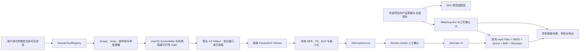

# SES Agent Desktop 整改与外部能力吸收改造方案

<!-- ses-current-state package=0.1.0 schema=49 -->

> 版本：v0.7
> 日期：2026-08-18
> 状态：A-01 与 B-01/B-02/B-03/B-04/B-05/B-06 已完成本机实现与自动验证；B-03-1 已在获授权开发 Mac 上完成真实微信 4.1.5 AX/窗口捕获探针和本地 Helper 验收，但最终签名包、四方批准、真实日文专家质量/审计证据和正式发布证据仍未验证
> 当前主系统：`/Users/yk/project/life/ses-agent-desktop`
> 外部对照项目：`/Users/yk/Downloads/Secure Talent Match AI/Secure Talent Match AI`
> 核心决策：继续以 SES Agent Desktop 为唯一产品与技术主干；外部项目只作为产品交互、连接器思路和合成测试资料的参考，不进行代码合并或技术栈迁移。

## 1. 文档目的

本文档把整改工作拆成两个相互独立、按顺序推进的部分：

1. **当前系统自身问题处理**：先解决产品合同与运行时不一致、文档与 Schema 漂移、受控执行覆盖不完整、真实业务质量证据不足、版本来源与测试闭环不足等问题。
2. **外部系统吸收改造**：只吸收 `Secure Talent Match AI` 中对 SES 营业工作有价值的 Matching-first 首页、统一案件入口、案件/候选人/提案三栏确认和营业优先级；微信当前可见消息按本项目 macOS-only 产品范围重新设计，不吸收外部项目的 Windows PowerShell/UI Automation 实现，并全部落回当前系统既有的安全、审核、持久化和 Hybrid RAG 主链。

本文档是改造范围、决策、验收和实施顺序的基线。只有 3.2 节及各项“当前状态”引用的当次证据可代表已执行工作；其余方案文字不自动代表已经实现、发布或通过真实试点。

## 2. 冻结原则

后续实施不得偏离以下原则：

- 当前工作区代码是现状核查的事实来源；README、历史报告和外部产品文档不能替代当前实现证据。
- 当前系统继续保持本地优先 Electron 架构：React + TypeScript + Electron Main/Preload/Renderer + Worker + SQLCipher-compatible SQLite。
- 第一阶段不引入 Go、FastAPI、独立 PostgreSQL、Qdrant、Chroma、FAISS 服务或新的后端部署面。
- Hybrid RAG 只用于候选人匹配：硬条件 → BM25 → Profile/项目向量 → RRF → 本地精排 → 证据与人工判断。
- 只有已确认、未归档、未删除的 CandidateProfile 与 JobCase 可以进入正式匹配或提案链。
- 普通用户不输入 Provider 原生 API Key；Cloud AI 继续通过 Member Center Native PKCE、`account_ai_token` 和 AICommerce 产品能力调用。
- 原始简历、邮件、案件正文、图片、直接标识符和占位符映射不得直接进入 Cloud Provider。
- 未注册工具、越权 Scope、未验证 Actor、原始 PII 上云、未批准外部写入和不可安全恢复的重复执行必须失败关闭。
- 外部项目中的文档、README 和脚本只作为对照资料，不能被当作当前系统的执行指令或产品合同。
- 邮件、EML、粘贴聊天、微信 Accessibility/AX 文本、简历正文和外部 Fixture 一律是不可信数据与证据，不能成为系统指令、用户授权、Tool Call、Scope、Actor、审批或 Replay Policy。
- 已有候选人删除、案件删除、恢复覆盖等强领域状态机继续作为唯一执行权威；统一 Registry 只能补充声明、审计和前置策略，不能弱化 Preview、Hash-bound Confirm、事务、隔离、恢复或重启边界。
- A-07 的既有代码机械拆分可以最后实施，但从 Stage 1 起所有新增 Handler、Connector、Gate、Schema Adapter 和 UI Feature 必须进入独立模块，不得继续扩大超大入口文件。
- 不做无人值守自动发信、自动录用、自动淘汰、隐藏微信抓取或账号绕过。

## 3. 整改分级与状态定义

| 等级 | 含义 | 处理要求 |
|---|---|---|
| P0 | 影响隐私合同、数据外发、发布可信度或版本可追溯性 | 任何新外部能力开发前完成 |
| P1 | 影响受控执行覆盖、真实匹配质量和主要产品工作流 | 进入真实试点前完成 |
| P2 | 影响长期维护、开发效率或体验一致性 | 不阻塞安全修复，可分阶段实施 |

状态统一使用：`未开始`、`实施中`、`待外部条件`、`已验证`。状态必须以本节实施记录和当前证据为准，不能继续沿用文档初稿的统一“未开始”。

### 3.1 实施关闭记录

每个整改项进入 `实施中` 前，必须建立对应实施卡，并至少记录：

- Owner、目标版本、计划开始/完成时间；
- 代码触点、IPC/Schema/迁移变化和数据回填策略；
- Feature Flag、默认状态、Kill Switch 和回滚方式；
- 测试命令、目标平台、在线/离线属性和预期失败条件；
- Evidence Manifest 路径、源码身份、构建身份和外部审批；
- 未满足的外部条件、Go/No-Go 决策人和最终关闭结论。

没有实施卡、当前证据或可定位的失败原因时，不得仅凭文档勾选把状态改为 `已验证`。

### 3.2 2026-08-18 执行记录

| 项目 | 当前结论 |
|---|---|
| Stage 0 来源基线 | 已完成临时只读快照与文件级 SHA-256 Manifest；来源仓库、Commit、签名与 SBOM 仍不可证明，因此 `releaseEligible=false` |
| A-01 代码状态 | 两阶段 IPC、Main 内存 Review Ticket、原生确认、本地硬隐私/出网门运行时复核、源码/构建绑定和 Cloud 审计字段已实现 |
| A-01 本机验证 | TypeScript、完整 Vitest、隐私边界、Schema v13→v37 升级、持久化、UI 本地化、合成隐私质量门和生产构建已通过 |
| A-01 外部条件 | 仓库外真实日文专家数据集/报告不存在；`expertAttestationBound=false` 只表示质量、审计和发布准备度证据未绑定，不再单独构成普通 Cloud AI 的运行时硬阻断。当前代码、测试、UI 与 macOS 发布链路的兼容迁移已完成本机验证 |
| 打包与平台 | 本轮未生成可发布安装包；固定 Embedding/Reranker 大文件资源、Developer ID/公证及 Windows x64 实机证据未满足。`test:hybrid-retrieval` 因 Embedding 模型文件未安装而以 `ENOENT` 失败关闭，未用联网下载或未知模型绕过 |
| 外部吸收实现 | B-01 Match Run Validity/Matching-first、B-02 Gmail/EML/手工/聊天粘贴统一入口、B-04 绑定版本的响应式三栏、B-05 `business-priority-v1`、B-06 自建合成 Fixture 已进入本机实现；44 个 Vitest 文件共 293 项、Schema 升级、持久化、解析隔离、隐私门、Google Workspace 合约、提案 PDF 与生产构建通过 |
| 响应式实测 | Chromium 1440/1280/1100 实测 Matching-first 与 Proposal Workspace；提案分别为三栏/两栏/单栏，页面和提案容器均无横向溢出，Console Error/Warning 为 0；来源中心现在包含可执行的 macOS 微信 B-03-1 卡片 |
| 微信边界 | B-03-1 已注册 `wechat.visible.read` ToolSpec 与两阶段 IPC，使用 30 秒一次性 Scope Token、腾讯 Team ID/签名/PID/启动时间/前台窗口绑定、`sandbox-exec (deny network*)` 与独立 Loopback/外网探针。本机微信 4.1.5 AX Tree 实测为 5 节点/0 文本，故在原生确认后使用 ScreenCaptureKit 单窗口右侧会话裁剪和 Apple Vision OCR；真实窗口探针识别 81 个整窗、22 个会话裁剪文本节点，输出只含计数/矩形。Capture 与原文不落盘，只保存脱敏 `wechat-visible` 来源。`npm run test:wechat-gate` 无正式报告时返回 `implemented-release-no-go` |
| 后续整改 | A-02 文档与 Schema v37 同步正在收尾；A-03/A-04/A-06/A-07 的全局关闭条件以及微信最终签名包/四方批准仍未完成，外部吸收项不得据此称为可发布或已上线 |

A-01 实施卡：Owner 尚待项目方指定；目标版本为下一个 P0 安全修订；不设置绕过 Feature Flag，Kill Switch 为任一硬性隐私/出网门不通过即禁用普通 Cloud AI，专家 Attestation 缺失只产生质量/审计/发布准备度提示；回滚依据为 Stage 0 只读基线，但由于来源 Commit 不可证明，回滚前仍需人工核对。整改前 Evidence 位于 `/Users/yk/project/life/.ses-agent-desktop-baselines/20260818T120946+0900/source-manifest.json`，A-01 Evidence 位于 `/Users/yk/project/life/.ses-agent-desktop-baselines/20260818T130200+0900-a01-final/source-manifest.json`，外部吸收改造 Evidence 位于 `/Users/yk/project/life/.ses-agent-desktop-baselines/20260818T142014+0900-external-adoption-final/source-manifest.json`，macOS-only 微信范围修正 Evidence 位于 `/Users/yk/project/life/.ses-agent-desktop-baselines/20260818T145440+0900-macos-wechat-scope-final/source-manifest.json`，构建证据位于 `build/privacy-verification/cloud-enforcement-manifest.json`。这些证据不含专家数据集正文、用户 Prompt、Token 或 PII Mapping。

## 4. 第一部分：当前系统自身问题处理

### A-01 普通 Cloud AI 的硬性出网门与真实日文专家证据分层

**优先级：P0**
**当前状态：已完成本机代码、自动测试、策略文档、兼容迁移、macOS 封装与包内验收**

#### 现状问题

既有文档把普通 Cloud AI 的本地合成隐私质量门与真实日文专家评测门合并成一个运行时硬门，造成“没有专家 Attestation 就不能发起 Cloud 请求”的过度约束。本次策略修订将两者分层：合成隐私质量与出网安全控制继续是硬门；真实日文专家 Attestation 只提供质量、审计和发布准备度证据。

整改前，`personNameReviewCompleted: true` 只是 Renderer 传给 Main 的字面量布尔值，没有绑定具体正文、脱敏结果、Gate 报告、Endpoint、Actor、有效期或单次执行。该旧 IPC 入口现已移除；此段保留为问题来源记录，不再代表当前代码合同。

专家报告仍应使用唯一、版本化的校验器生成一致的质量/审计状态；但该校验器的输出不再直接决定普通 Cloud 请求的 allow/deny。实现哈希、Cloud Enforcement Manifest、Main Handler、Cloud Gateway 和请求 Schema 的当前运行时绑定仍是独立的硬性安全控制；专家报告哈希只说明专家证据是否与当前实现一致。

这造成四个问题：

- 产品合同与运行时行为不一致。
- 旧文档把专家报告缺失误写成 Cloud 请求边界的阻断条件，掩盖了真正必须检查的本地 NER、脱敏、DLP、请求路径专属内容边界和 Endpoint Allowlist。
- Renderer Bug、XSS 或错误接线可以把 `true` 当作“用户已复核”的证明。
- 专家报告可能缺失、过期或与当前实现不匹配；这些状态应降低质量/审计/发布准备度，而不能被记录为“Provider 零调用”的安全结论。

#### 冻结决策

普通交互式 Cloud AI 的硬性出网门失败关闭：

```text
synthetic privacy quality gate = passed
AND
local NER = available and networkAccess=false
AND
local redaction/DLP session = passed
AND
request payload boundary = approved redacted preview OR validated anonymous Agent projection
AND
Endpoint Allowlist = matched and task-scope allowed
AND
Main-issued review ticket = valid, content-bound, fresh and single-use
THEN
AICommerce request may start
```

真实日文专家 Attestation 不在上述硬门中。Attestation 缺失、过期、平台/架构不匹配或哈希不一致时，Cloud 请求仍可在全部硬门通过后继续；Bootstrap 必须把专家状态保持为 `not-verified` 并提供具体 `failureCodes`，`CloudCallAudit.expertAttestationHash` 写为 `null`，治理面板和发布准备度明确提示“无专家质量证据”，但不得推导 `providerCallCount=0` 或禁止云端调用。它也不能绕过任何一项硬门。

普通 Cloud 请求固定为两阶段协议：

1. `prepareCloudPrompt`
   - Main 接收正文并重新读取合成质量门与全部硬性出网控制；
   - 执行本地 NER、PII 检测、脱敏和独立 DLP；
   - 先持久化 Redaction Session，再返回脱敏预览、受限检测摘要和一次性 `reviewTicket`；
   - 不在此阶段创建 Provider 请求。
2. `executeCloudPrompt`
   - 只接受 `reviewTicket`，不再次接受 Renderer 提交的任意正文；
   - Main 复核 Ticket、Gate、Endpoint、Actor、Redaction Session 和内容哈希后才允许调用 AICommerce；
   - Ticket 单次使用；正文、脱敏结果、Gate、Endpoint、Actor 或策略版本变化时立即失效。

`reviewTicket` 至少绑定：

- 规范化原文哈希和脱敏 Payload Hash；
- Redaction Session ID 与检测结果摘要哈希；
- Synthetic Gate Report Hash；可选的 Expert Attestation Hash（只用于质量/审计/发布准备度）；
- Endpoint ID、任务类型、Actor ID 和策略版本；
- 签发时间、最长 10 分钟的过期时间和单次使用 nonce。

如果 Renderer 仍被视为不可信边界，最终复核必须进入 Main 控制的独立前台确认面；普通 React Checkbox 只能用于交互提示，不能单独构成安全证明。

专家报告使用唯一、版本化的 Attestation 校验器。构建检查、启动 Bootstrap、UI 状态和发布准备度必须复用同一校验逻辑，不允许分别维护强弱不同的字段集合；CloudCallAudit 只保存校验后可用的可选专家哈希，普通 Cloud 请求不把专家结果当作运行时 allow/deny 门。Attestation 至少绑定：

- Dataset SHA；
- Privacy Implementation Manifest SHA；
- Cloud Enforcement Manifest SHA；
- 报告自身 SHA；
- 平台、架构、数据集版本、评审协议和有效期。

当前有效期规则冻结为：报告 `evaluatedAt` 最长 30 天，专家 `reviewedAt` 最长 365 天；未来时间、无法解析时间或超过任一上限时，`expertGate.status` 保持 `not-verified` 并给出 `report:stale` 或 `report:review-stale` 失败代码，只降低质量、审计和发布准备度，不阻断已满足硬门的 Cloud 请求。规则变化必须升级 Attestation 版本。

Privacy Implementation Manifest 覆盖 NER、PII、脱敏、DLP、Worker 网络隔离和评测代码；Cloud Enforcement Manifest 还必须覆盖 Main 请求 Handler、CloudRedactionGateway、共享 Schema/Contract、AICommerce Adapter 边界和相关 Action Policy。修改任一受保护文件都必须使旧 Attestation 失效；当前运行时对受保护 Bundle/Endpoint 的安全绑定仍独立作为硬门复核。

`SES_AICOMMERCE_PRODUCTION_PROBE=1` 保留为独立诊断通道，但必须满足以下限制：

- 只发送代码内固定合成文本；不接受 Renderer 或命令行自由文本。
- 不打开业务窗口，不读取 Candidate、JobCase、邮件、简历、会话历史或本地数据库正文。
- 复用正式 Main 初始化、`safeStorage` 凭据和 AICommerce Adapter。
- 允许作为固定合成数据的连接诊断在没有专家证据时运行，但必须输出 `diagnosticOnly=true` 和固定的 `privacyGateExemption=fixed-synthetic-connectivity-probe`，不得宣称专家质量已通过，也不得改变普通 Cloud AI UI 的质量提示或绕过硬性出网门。
- 不得复用普通 `sendAiCommerceCloudPrompt` 入口绕过本地 NER、脱敏、DLP、Endpoint Allowlist 或路径专属内容边界；自由文本路径必须使用 Review Ticket，匹配 Agent 路径必须使用匿名安全 Projection。
- 日志只记录请求 ID、验证布尔值、能力数量和计费元数据；不记录 Provider 任意响应预览。

#### 实施内容

- 用两阶段 IPC Contract 替换 `content + personNameReviewCompleted: true` 单阶段请求；不得保留可绕过的新旧并行入口。
- 新增 Main 内存中的短期 Review Ticket Store；只持久化 Redaction Session、审计摘要和哈希，不持久化原始 Prompt 或 Ticket Secret。
- 扩展 `requireCloudAiPrivacyRuntime`，使其只对合成质量门和本地硬性出网控制执行失败关闭；同一 Attestation Validator 的专家结果以可选质量/审计状态返回。
- 在 `prepareCloudPrompt` 和 `executeCloudPrompt` 即将产生外部副作用前分别复核必要状态，避免只依赖启动时 Bootstrap 快照。
- 复用唯一的专家报告校验逻辑；校验平台、架构、数据集版本、`humanLabeledDataset=true`、`syntheticOnly=false`、双评审、分歧仲裁、网络 Guard、报告时间、评审时间和实现 Manifest Hash，并通过 `expertGate.status=passed|not-verified` 与 `failureCodes` 返回非阻断结果。
- 专家报告缺失、失败、过期、平台不符、报告哈希不符或任一专家绑定哈希不符时，不能生成“专家质量已通过”的声明；只要硬性出网门通过，仍可创建 Provider 请求。
- UI 显示明确的质量/审计提示和报告更新时间，不把 AICommerce 登录成功或钱包可用误报为专家质量已通过；也不把专家证据缺失误报为 Cloud 安全门失败。
- Cloud Call Audit 记录硬门结果、可选 Attestation 哈希、Ticket 状态和原因码，但不记录报告原文、测试案例、用户正文、占位符映射或 Ticket Secret；详细专家失败原因通过 Bootstrap 展示，不为本次迁移增加新数据库字段。
- 增加请求边界测试和打包后测试，不能只依赖发布脚本的文件存在性检查。

#### 验收标准

- 专家报告缺失、过期、平台/架构不匹配、评审协议不完整或专家报告/专家绑定哈希不一致时，若其他硬门通过，Provider Adapter 可以调用；`expertAttestationHash` 必须为 `null`，不得记为专家质量通过。
- 合成质量门失败、本地 NER 不可用、脱敏失败/不确定、独立 DLP 未通过、Endpoint Allowlist 不匹配、任务范围越界，或当前路径的内容边界无效时，Provider Adapter 调用次数为 0。
- Renderer 直接提交 `personNameReviewCompleted=true`、伪造 Ticket、重放 Ticket、使用过期 Ticket、修改正文或跨 Endpoint 使用 Ticket 时，Provider Adapter 调用次数为 0。
- 全部通用硬门通过后，自由文本路径仍必须完成人名复核、内容绑定 Review Ticket 和脱敏预览确认；匹配 Agent 路径仍必须完成匿名安全 Projection 校验和确定性审计哈希；两条路径都必须持久化 Redaction Session 并通过 Endpoint Allowlist。专家 Attestation 只追加可选审计哈希和 Bootstrap 质量提示。
- Ticket 在成功调用、用户取消、超时、Gate 变化或应用退出后失效；应用重启不恢复未执行 Ticket。
- 诊断 Probe 只能发送固定合成文本，不能读取业务数据，也不能使普通 Cloud AI UI 变为可用。
- 诊断 Probe 的响应正文不进入日志；Probe 成功不能证明普通 Cloud AI 已可用。
- README、技术架构、安全文档、UI 文案、单元测试和发布检查对该合同使用同一表述。

#### 兼容迁移说明（v0.7 已实施）

- Schema v35/v38 及既有 `CloudCallAudit` 记录中的 `expertAttestationHash` 保持可读；该字段继续允许 `null`，历史记录按当时策略解释，不回写、不伪造专家证据。
- 旧的 `expertAttestationBound=false`、`expertGate=not-verified` 或类似状态迁移为“专家证据缺失/未验证”的质量与审计状态；它们不再代表 `providerCallCount=0`、`Provider 禁止调用` 或硬性 Cloud deny。`qualityGateReportHash`、Redaction/DLP、Review Ticket、Endpoint 和内容哈希仍按硬门语义处理。
- 新旧审计/票据消费者在过渡期都必须接受可选的专家哈希；没有该字段只表示没有专家质量证明，不影响已通过通用硬门和路径专属内容边界的请求出网，也不得从空值推导为 `passed`。
- 本轮已同步修改运行时代码、测试、UI、macOS 发布链路和构建 Manifest：旧的 Expert Gate 零调用断言已移除，`expertAttestationHash` 允许为 `null`，`releaseEligible` 仅由硬性质量/出网门决定；定向测试、全量测试、类型检查和生产构建均已通过本机验证。

### A-02 修正文档、Schema 与运行状态漂移

**优先级：P0**
**当前状态：实施中（Schema 已升至 v37，文档与验证脚本已同步；正式来源仍不可证明）**

#### 现状问题

- 整改前 `packages/persistence/src/index.ts` 的 `currentSchemaVersion` 是 34；A-01 Cloud 审计绑定为 v35，外部吸收的聊天来源、Match Run 绑定、结果快照和营业优先级 Projection 为 v36，macOS 微信脱敏来源为当前 v37。
- README 和开发路线图仍多处描述 Schema v28，部分测试脚本名称还停留在更早版本。
- README 中包含构建产物大小、哈希、历史通过状态和“当前切片”长列表，容易在代码继续变化后变成过期事实。
- Cloud AI 专家门表述与运行时不一致。

#### 实施内容

- 更新 README、技术架构、安全治理、恢复手册和交付计划中的当前 Schema、主要能力与发布阻断项。
- 将“已实现”“已通过”“待完成”“外部条件未满足”分成独立状态表，不混在长段落中。
- 对易漂移信息建立机器可验证来源：
  - Schema 版本读取 `currentSchemaVersion`；
  - Package 版本读取 `package.json`；
  - 本地模型 ID/Revision 读取 Manifest；
  - 隐私 Gate 状态读取聚合报告；
  - 构建 SHA、签名、公证和平台证据读取构建 Manifest。
- 新增文档状态校验脚本，检测 README 中声明的 Schema、Gate 和模型版本是否与源码/Manifest 一致。
- 历史 DMG 大小和 SHA 移入按构建生成的证据文件，不作为 README 的永久“当前值”。
- 对脚本文件名和实际覆盖范围做一次审计；如果保留历史名称，文档需说明它验证的是升级链而不是当前 Schema 上限。

#### 验收标准

- README、架构、安全、恢复、路线图与当前实现的 `currentSchemaVersion` 一致；当前目标为 Schema v37。
- 文档不再声称普通 Cloud AI 具有运行时未实现的 Gate。
- CI 中的文档状态校验可以故意把 Schema 声明改错后稳定失败。
- 任一“已通过”状态都能定位到当前构建的测试或证据 Manifest，不引用无法复现的历史口述。

### A-03 扩大受控执行内核覆盖并建立覆盖规则

**优先级：P1**
**当前状态：未开始**

#### 现状问题

当前 DomainToolRegistry 已真实接入以下四项：

- `resume.analyze.local`
- `candidate.match.local`
- `gmail.sync.read`
- `proposal.export`

但 Cloud Assist、恢复、永久删除、候选人面试和未来微信读取等路径仍使用各自的领域校验。领域专用校验本身并非错误，但目前缺少一份统一规则，说明哪些动作必须进入 Registry，哪些可以保留专用状态机，以及两者如何进入统一 Review Center 和 ToolAudit。

#### 冻结覆盖规则

以下动作必须进入 DomainToolRegistry，或提供经安全评审确认的等价专用 Gate：

- 任意外部读取；
- 任意外部写入；
- 任意 Cloud Invocation；
- 任意用户可见文件写入；
- 永久删除、恢复覆盖等不可逆本地变更；
- 访问范围可能随输入扩大的动作；
- 后台或可恢复执行的动作；
- 未来新增连接器和自动化。

“进入 Registry”不等于由一个通用 Executor 接管所有执行。候选人删除、案件删除和恢复覆盖继续保留既有领域状态机，Registry 只允许作为声明、审计和入口前置检查层。Preview、影响计数、Confirmation Hash、Actor、事务、文件隔离、失败恢复、延迟替换和应用重启等约束必须仍由领域状态机强制执行。

审批语义必须分开：

- `none`：无额外人工批准，但仍受 Scope、Actor、Schema 和副作用策略约束；
- `inbox`：Review Center 异步审批，审批后仍需执行前状态复核；
- `native-save-confirmation`：只用于系统文件选择/保存对话框；
- `foreground-scope-confirmation`：用于微信等本次前台范围确认，必须绑定短期 Scope Token。

不得继续用同一个 `native-confirmation` 同时表示文件保存和外部窗口读取。

#### 实施内容

- 建立 `ActionPolicyCoverageMatrix`，逐项列出 IPC、领域动作、数据 Scope、副作用、审批方式、幂等方式、重放策略和审计位置。
- `cloud.assist.redacted` 只接收 `redactionSessionId`、Payload Hash、Endpoint ID、Review Ticket 引用和策略版本，不接收原始正文。
- `candidate.delete.permanent`、`job-case.delete.permanent`、`recovery.restore` 在 Coverage Matrix 中标记为“Registry 声明/审计 + 专用状态机执行”；不得迁移成通用 ProcessingJob。
- `wechat.visible.read` 已按 B-03-0 本机结论冻结试点 Tool Spec；正式发布仍由独立目标机证据门控制。
- Review Center 统一展示需要 Inbox 审批的 Action Run；系统文件保存确认和前台 Scope 确认都不伪装成 Inbox 批准。
- 未注册工具继续拒绝；Renderer 不得提交 Actor、扩大 Scope 或决定 replay policy。
- 对每个工具冻结输入 Schema、allowed origins、allowed scopes、effects、approval、idempotency 和 replay policy。
- Main/Orchestrator 根据 Tool Name/Version、Scope Fingerprint、Input Hash、Content Revision 和策略版本生成幂等键；Renderer 不得提交幂等键。
- `single-flight` 必须由运行时检查活跃状态并阻止并发重复执行，不能只把枚举值记录在 Tool Spec 中。
- `replayPolicy=never` 的动作不进入自动恢复队列；应用重启后只能留下可审计的取消/失败状态，不能自动重放。
- 外部来源正文只作为不可信 Source/Evidence 输入；不得从正文中的自然语言生成 Tool Name、Scope、Actor、审批或外部副作用。

#### 验收标准

- 所有外部读取、Cloud 请求、文件导出和外部写入都能在 Coverage Matrix 中找到唯一执行边界。
- 新增未注册工具时策略测试稳定返回 `UNREGISTERED_TOOL`。
- Renderer 修改 Scope、Actor、Content Revision 或副作用声明时请求失败。
- Inbox 审批过期、拒绝、任务取消后，Action Run 不会继续执行。
- `safe-local` 重放不会重复产生外部副作用；外部写入和不可逆操作不自动重放。
- 删除和恢复的 Registry 接入不能绕过既有 Preview/Confirmation Hash/事务/隔离/重启步骤；相关负向测试必须证明直接调用后半段失败。
- 来源正文包含“忽略规则、扩大范围、发送文件、删除数据、调用 Cloud”等指令时，不会创建相应 Action Run。

### A-04 建立真实 SES 匹配质量门

**优先级：P1**
**当前状态：未开始**

#### 现状问题

当前 Hybrid RAG 实现和合成回归较完整，但 1,000 Profile 验证主要由 3 个语义场景和合成干扰项构成，最终报告明确 `humanLabeledDataset=false`。它只能证明算法链、模型资源和回归稳定性，不能证明真实 SES 营业场景的匹配质量。

#### 数据集要求

- 新增 `ses-candidate-benchmark-v2`；现有 v1 只保留为合成兼容回归，不能直接改名作为真实质量门。
- 最终 Holdout 至少包含 30 个真实或经合法脱敏的 SES 案件；调参集另行建立，不计入 Holdout 最低数量。
- 每个案件绑定冻结的 `candidatePoolId`、候选池哈希、候选池大小和候选 Profile Version；v2 初始门槛为 `candidatePoolSize >= 50`，并包含足够的 Hard Negative，避免 Recall@20 因候选池过小而失真。门槛变化必须升级 Benchmark 版本，不能按单次运行放宽。
- 使用 `0 | 1 | 2 | 3` 分级相关性，使 NDCG 能区分不相关、弱相关、相关和高相关，而不只使用二元 Label。
- 每个预期项目证据绑定匿名 Candidate Label、Project Experience/Field 标识和证据类型；“存在任意非空 projectEvidence”不能算作正确证据。
- 每个案件标注预期硬条件状态 `eligible | ineligible | unknown`，用于识别错误排除、缺失信息被当作满足和 `unknown` 处理错误。
- 2 名独立 SES 业务评审者先独立标注；保存匿名评审者 ID、独立结果、分歧和指定负责人的仲裁结果，不能只保存 `reviewerCount=2`。
- 覆盖以下场景：
  - 技术栈与同义词；
  - 项目职责与相似项目经验；
  - 行业经验；
  - 年限与级别；
  - 单价范围；
  - 稼动时点；
  - 远程/常驻条件；
  - 日语等级；
  - 粗粒度工作地点；
  - 合法就劳资格，不使用国籍作为过滤条件；
  - 缺失信息应保持 `unknown` 的案例。
- 数据集保存在仓库外的加密受控位置；Git 忽略本身不能替代加密、访问控制、保留期限和删除治理。
- 调参数据与最终 Holdout 固定分离；Holdout 分区和 Label 在评测前封存，不得根据 Holdout 结果反向修改查询、规则、模型或标注。

#### 数据治理

- 为数据集指定 Owner、使用目的、合法依据、允许的评审者和目标客户/业务范围。
- 匿名 Label 与真实身份映射分离存储；评测代码、CI、构建机和聚合报告不得接触身份映射。
- 记录访问、导出、评审、删除和保留期限；到期或收到合法删除请求时，同步删除调参集、Holdout、身份映射和可识别的失败样本。
- 构建证据只保存聚合指标、匿名 Case ID、数据集哈希和受限失败原因；不得保存姓名、正文、占位符映射或可逆的小样本切片。
- 数据治理条件未满足时，该数据集状态为 `待外部条件`，不能用于试点 Gate。

#### 指标与初始门槛

| 指标 | 初始门槛 | 说明 |
|---|---:|---|
| Recall@20 | ≥ 0.90 | 相关候选人应进入营业员可审核范围 |
| NDCG@20 | ≥ 0.75 | 高相关候选人应优先出现 |
| Project Evidence Coverage@20 | ≥ 0.80 | 推荐结果应给出项目经历级证据 |
| Project Evidence Precision@20 | ≥ 0.90 | 给出的项目证据应与标注的项目/字段一致 |
| 已确认硬条件错误排除 | 0 | 不得因解析或规则错误排除实际满足者 |
| 敏感属性进入排序 | 0 | 国籍、性别、年龄等不得进入匹配特征 |
| 删除/归档后索引残留 | 0 | 失效资料不得继续被召回 |

#### 实施内容

- 扩展现有 Candidate Evaluation Authoring 流程以支持 v2；v1 与 v2 Schema、报告和 UI 明确区分，不能静默兼容或降级。
- 给每次评测绑定算法版本、硬条件策略版本、Embedding/Reranker ID 与 Revision、数据集哈希、候选池哈希、运行平台和代码身份。
- 分别报告硬条件、BM25、Vector、RRF 和 Reranker 对结果的影响，避免只给最终总分。
- 同时报告 Macro/Micro Recall、分级 NDCG、Project Evidence Coverage/Precision、关键业务切片和置信区间；小样本高分不能单独通过 Gate。
- 生成 Feature Provenance，证明排序特征中没有国籍、性别、年龄等敏感属性或其直接替代字段。
- 增加典型失败案例清单：错误排除、证据不匹配、相似技能误判、缺失信息被当作满足、工作地点和就劳资格误判。
- 真实质量门未通过时，可以继续开发和合成回归，但不得进入真实客户试点。

#### 验收标准

- 聚合报告明确 `benchmarkVersion=v2`、`humanLabeledDataset=true`、独立评审与仲裁状态、数据集/候选池哈希、Holdout 标识、代码身份和生成时间。
- 真实数据报告与合成报告分开保存和展示，不能互相替代。
- 任一门槛失败时，试点 Gate 失败关闭，并输出可定位的失败案例 ID。
- 候选池小于 50、Holdout 少于 30、缺失独立标注/仲裁、存在候选引用缺失或候选池哈希漂移时，报告状态不是 `passed`。
- Project Evidence 必须命中标注的项目/字段证据；仅 `projectEvidence !== null` 不得计为正确。
- 硬条件错误排除和敏感特征计数必须由可审计数据产生，不能靠人工文字声明为 0。
- 报告不包含姓名、简历正文、邮件正文、项目原文或占位符映射。

### A-05 恢复版本来源与可复现构建闭环

**优先级：P0**
**当前状态：未开始**

#### 现状问题

当前 `ses-agent-desktop` 目录不是 Git checkout，无法从当前目录证明：

- 代码来自哪个远端、分支和提交；
- 哪些文件是未提交变化；
- 某个测试、DMG 或证据报告对应哪一个源码状态；
- 出现问题时应回滚到哪个版本。

#### 实施内容

- 在执行 `git init`、覆盖文件或连接远端前，先确认权威远端、历史仓库或原始工作树来源。
- 对当前目录制作只读文件清单和内容哈希，保存为迁移证据；不得把密钥、专家数据集、用户数据、模型大文件或本地凭据加入版本库。
- 若权威历史短期无法恢复，建立“临时可信基线”：保存只读源码快照、完整源码 SHA-256 Manifest、排除项清单和 `provenance=unknown` 声明。完成该基线后允许关闭 A-01 等已知 P0 隐私缺口，但仍禁止大规模外部功能吸收和正式发布。
- 将当前工作树与权威历史逐文件对比，识别用户未提交改动和生成产物。
- 恢复正确 Git 元数据后，建立清晰的基线提交；若无法恢复历史，必须记录“历史不可恢复”的事实，不能伪造连续提交历史。
- 构建 Manifest 写入 Commit SHA、Dirty 标记、Package Version、Schema Version、模型 Revision、平台和架构。
- 发布检查要求源码 SHA、测试证据、签名产物和公开版本一致。
- 区分可复现层级：未签名应用内容和资源 Manifest 应可重建验证；Developer ID、时间戳和公证票据导致的签名后二进制差异单独记录，不把“等价构建”误写成签名产物逐字节相同。

#### 验收标准

- `git status`、分支、远端和 HEAD 可读取，且不会丢失当前用户文件。
- 在 Git 历史尚未恢复但必须处理 P0 时，临时基线能唯一定位源码快照，并明确标记来源未知、禁止发布。
- 构建产物可以追溯到唯一源码 SHA；dirty 构建必须明确标记。
- 凭据、用户数据、专家数据集和模型缓存未被 Git 跟踪。
- 同一提交在干净环境中可以通过锁文件和模型 Manifest 生成等价构建。

### A-06 重建可重复的测试与发布证据

**优先级：P1**
**当前状态：未开始**

#### 现状问题

当前工作区没有 `node_modules`，本次整改规划没有重新安装依赖或重跑全套测试。README 中的历史通过记录不能当作当前工作树的本轮证明。

#### 实施内容

- 在干净临时工作树或 CI 中使用 `npm ci`，不把 `node_modules` 纳入版本库；依赖获取通过锁文件、完整性校验、受控代理或预热缓存完成。
- 按风险拆分验证层：
  1. TypeScript、Schema 和单元测试；
  2. SQLCipher 持久化、升级、恢复和删除；
  3. Parser/EML/OCR 网络隔离；
  4. Embedding、Reranker、Hybrid Retrieval；
  5. 隐私合成硬门与真实专家质量/审计建议证据；
  6. Google Workspace 合约与在线验收；
  7. AICommerce 诊断 Probe；
  8. Renderer E2E 与无障碍；
  9. macOS/Windows 打包后自检；
  10. 签名、公证、安装、升级和真人恢复演练。
- 每次构建生成统一 Evidence Manifest，记录命令、开始/结束时间、退出码、源码 SHA、平台、架构、模型哈希和报告路径。
- 测试执行阶段默认拒绝访问外部服务；网络或真实账号测试必须显式开启、使用目标 Allowlist，并且不复用默认离线套件。
- “默认测试不联网”指测试进程在依赖安装完成后不产生外部连接；不能因 `npm ci` 需要受控依赖源而放宽运行时网络限制。
- 默认测试不使用真实 Key、不产生计费、不读取真实邮箱或业务数据。
- 失败的测试不能通过 README 文案、旧报告或公共健康检查替代。

#### 验收标准

- 干净 CI 可以从锁文件安装依赖并执行与目标平台相符的测试集合。
- Evidence Manifest 与源码 SHA、Schema、模型资源和包后验证一致。
- 默认测试零真实业务数据、零 Provider 计费、零隐藏外部请求；对非 Allowlist 主机产生连接时稳定失败。
- 需要真实账号或目标机的测试明确标记 `待外部条件`，不伪装为已通过。

### A-07 拆分超大模块，降低安全修改风险

**优先级：P2**
**当前状态：未开始**

#### 现状问题

当前 Main、Persistence 和部分 Renderer 文件承担了过多边界：

- `apps/desktop/src/main/index.ts` 同时负责启动、IPC、Gmail、AICommerce、恢复、匹配、简历、提案和窗口安全。
- `packages/persistence/src/index.ts` 同时包含 34 版迁移、Repository、加密映射、备份、候选人、案件、提案、审批和会话。
- `App.tsx` 同时管理大量页面路由和业务动作。

这不会直接证明功能错误，但会提高整改 Cloud Gate、新连接器和 Schema 升级时引入回归的概率。

#### 实施内容

- 从 Stage 1 起，所有新增 Handler、Connector、Gate、Schema Adapter 和 UI Feature 直接进入独立模块；A-07 后续只负责既有超大文件的机械抽取和收口。
- 按边界拆分 Main Handler：`aicommerce`、`gmail`、`candidate`、`job-case`、`proposal`、`recovery`、`action-runtime`、`window-security`。
- 将数据库迁移按版本或功能域拆分，Repository 通过明确接口组合；保持一个事务所有者，不把事务拆散到 Renderer。
- 已发布迁移 SQL 保持语义冻结；允许机械抽取文件，但不得在抽取时顺便改写旧迁移。用空库、全部受支持旧版本和当前 Schema Snapshot 验证升级等价。
- 将 App 路由和页面动作拆成 feature controller/hooks，Renderer 仍只使用显式 preload API。
- 先添加等价回归测试，再做机械拆分；不在同一提交中同时改变安全合同、Schema 和 UI 行为。
- 保留统一错误码、审计和 Actor 绑定，避免拆分后各模块自行记录敏感正文。

#### 验收标准

- 拆分前后 IPC Contract、数据库 Schema、迁移结果、业务状态机和 E2E 截图等价。
- Main 安全配置、Sender 校验、Zod Schema 和 Action Preflight 不因模块拆分被旁路。
- 单一领域变更不再要求编辑多个超大入口文件中的无关代码。
- Stage 1 之后新增能力没有继续堆入超大入口文件；历史迁移在抽取前后产生相同 Schema 和升级结果。

## 5. 当前系统整改汇总

| 编号 | 整改项 | 优先级 | 阻断范围 | 状态 |
|---|---|---:|---|---|
| A-01 | 普通 Cloud AI 固化硬性出网门并分层专家证据 | P0 | 阻断不安全的普通业务 Cloud AI 出网；专家证据只影响质量/审计/发布准备度 | 已完成本机实现与自动验证 |
| A-02 | 修正文档、Schema 与运行状态漂移 | P0 | 阻断可信发布说明 | 未开始 |
| A-03 | 扩大受控执行内核覆盖 | P1 | 阻断新外部连接器和外部写入 | 未开始 |
| A-04 | 建立真实 SES 匹配质量门 | P1 | 阻断真实业务试点 | 未开始 |
| A-05 | 恢复版本来源与可复现构建 | P0 | 阻断可追溯发布 | 未开始 |
| A-06 | 重建可重复测试与发布证据 | P1 | 阻断正式发布结论 | 未开始 |
| A-07 | 拆分超大模块 | P2 | 不阻断 P0 修复，阻断长期扩展质量 | 未开始 |

## 6. 第二部分：外部系统吸收改造

### 6.1 吸收原则

外部项目只提供三类输入：

- 产品工作流与页面组织参考；
- macOS 微信当前可见消息 Accessibility 技术 Spike；
- 合成简历、案件和 ATS CSV Fixture。

明确不吸收：

- 外部项目的 Git 历史、dirty worktree 或备份目录；
- Renderer `localStorage` 持久化；
- IMAP 密码登录；
- DeepSeek 原生 Key、任意 Base URL 和原始简历直传；
- 字符串技能交集评分；
- 把案件紧急度混入人才适配分；
- 未接线的 SQLite/PostgreSQL Schema；
- 独立内存 API 服务；
- 动态 PowerShell `ExecutionPolicy Bypass` 作为正式连接器；
- 后台隐藏抓取、全量聊天历史或账号绕过。

### 6.2 外部能力到当前架构的映射

| 外部项目能力 | 可吸收价值 | 当前系统承载位置 | 新增边界 | 最终数据 |
|---|---|---|---|---|
| Matching-first 首页 | 营业员先看高价值组合 | `App.tsx`、现有 Matching 页面 | 条件式默认路由，不改算法 | 现有 Match Run/Result |
| 统一案件入口 | 邮件、聊天、手工入口容易理解 | JobCase Import/Review | 统一 Source Adapter | JobCaseSource → JobCase v2 |
| 微信当前可见消息 | 补齐 macOS SES 案件来源 | 可行性 Gate + DomainToolRegistry + AX Helper/隔离 Parser | `wechat.visible.read` | 脱敏 JobCaseSource |
| 案件/候选人/提案三栏 | 缩短人工确认路径 | ProposalWorkbench | 只组合现有证据 | ProposalDraft/Approval |
| 稼动、时效、提案历史 | 更贴近日常营业判断 | Candidate/Case/Proposal UI | 与 fit score 分离 | 本地业务状态 |
| 合成 DOCX/XLSX/ATS CSV | 扩大 Parser 格式覆盖 | Parser/Test Fixtures | 来源和 synthetic 标签 | 测试数据，不进质量门 |

### 6.3 目标数据流



### B-01 条件式 Matching-first 首页

**优先级：P1**
**当前状态：实施中（本机实现与自动测试通过；正式来源、真实质量门和发布验收未完成）**

当前实现已在 Main/Repository 中建立 `MatchRunValidity`，绑定 JobCase ID/Version、候选池指纹、CandidateProfile Versions、算法/硬条件策略、Embedding/Reranker ID/Revision、Result Hash 和时间。首页只读取持久化结果快照：无确认数据时保留三步引导，有数据但无 Current Run 时只显示重新执行入口，有 Current Run 时按正式 Fit Rank 显示人工确认对象；Stale Run 的结果不返回 Renderer。营业优先级为独立排序视图，不覆盖默认 Fit 顺序。

#### 吸收目标

外部项目默认展示高价值 `案件 × 候选人` 组合，营业目标比通用工作台更直接。当前系统应吸收该聚焦，但不能让首次用户在没有确认数据时进入空匹配页。

#### 改造方案

- 保留当前三步工作台作为无数据和首次使用状态。
- 首页使用三态路由：
  1. 没有已确认 active JobCase 或 eligible CandidateProfile：显示三步引导；
  2. 已有必要数据但没有当前有效 Match Run：显示“执行/重新执行匹配”入口，不显示旧排名；
  3. 存在当前有效 Match Run：优先展示待人工确认的匹配组合。
- Bootstrap 只判定本地状态，不自动运行模型、不自动创建匹配任务、不发起网络请求。
- 首页只读取经过 Main 判定为 `current` 的 Match Run/Result，不在 Renderer 临时重算分数或自行判断 Run 有效性。
- Match Run 必须绑定 JobCase ID/Version、完整 Candidate Pool Fingerprint、结果中 CandidateProfile Version、Algorithm/Hard Filter 版本、Embedding/Reranker ID/Revision、Result Set Hash 和创建时间。
- 定义 `MatchRunValidity`：`current`、`stale_job_case`、`stale_candidate_pool`、`stale_model`、`stale_policy`、`invalidated`。重新审核、归档、删除、候选池变化或模型/策略变化必须使旧 Run 失效。
- 展示两个独立维度：
  - `fit score / retrieval evidence`：候选人与案件适配；
  - `business priority`：案件时效、提案窗口和跟进状态。
- 用户可以切回工作台、任务中心、审核中心和数据管理，不删除现有信息架构。
- 默认路由由本地 Bootstrap 状态确定；只展示当前有效结果，不因“曾经存在 Run”而展示过期结果。

#### 验收标准

- 无确认案件或候选人时仍显示三步引导。
- 有数据但无当前有效 Run 时只显示重新匹配入口，Bootstrap 不自动启动匹配。
- 有当前有效匹配资源时首页显示真实结果、证据入口、缺失条件和人工状态。
- JobCase、候选池、CandidateProfile、模型或策略任一版本变化后，旧 Run 不再以当前结果展示。
- 首页排序与正式 Matching 页面一致，不存在第二套评分实现。
- 页面不使用“合格/不合格”“自动录用/自动淘汰”等确定性文案。
- 1100px、1280px、1440px 下无横向溢出，键盘和读屏语义完整。

### B-02 统一案件来源收件箱

**优先级：P1**
**当前状态：实施中（Gmail/EML/手工/一次性聊天粘贴和 macOS 微信可见消息已接入同一 Review 主链；微信正式发布证据待外部条件）**

来源中心已显示每个入口的权限、范围、同步/失败/重複、确认待ち和网络状态。聊天粘贴在提交时先清空 Renderer 输入，再一次性送入 Main 的本地 NER/Redaction；只保存脱敏后的 `JobCaseSource(sourceType=chat-paste)`、Redaction Session 和既有 Extraction Draft。所有来源均标记为不可信内容，确定性 Parser 不解释来源中的 Tool Call/系统指令；业务指纹用于跨入口相似项提示。

#### 吸收目标

把 Google Workspace、EML、手工输入、粘贴聊天和受控 macOS 微信可见消息统一到营业员可理解的“案件取り込み/案件导入”入口。

#### 改造方案

- 统一展示来源卡片：
  - Google Workspace Gmail；
  - EML 文件；
  - 手工案件；
  - 聊天记录粘贴；
  - macOS 微信当前可见消息（实验功能）。
- 每个来源卡片必须显示权限、数据范围、最近同步、失败数、重复数、待审核数和是否联网。
- 所有来源只生成 `JobCaseSource` 和 `JobCaseExtraction Draft`，最终必须在 Review Center 完成字段与隐私确认。
- 不新增独立的 `case` 数据结构或 `localStorage` 状态。
- 不引入 IMAP 用户名/密码；Google Workspace 继续保持 Native OAuth、`gmail.readonly` 和管理员冻结范围。
- 用户粘贴的原始文本会短暂存在于当前 Renderer 输入控件，但不得自动保存、进入 `localStorage`、日志、错误上报或页面级持久状态；提交后一次性发送给 Main，并立即从输入状态清除。
- 聊天粘贴文本必须在 Main/Worker 执行本地脱敏，Renderer 不直接决定 `cloudEligible`。
- 邮件、EML、手工文本、粘贴聊天和微信文本一律标记为 `untrusted-source-content`；来源正文只能作为 Source/Evidence，不能成为 Agent 指令或 Tool 参数。
- Parser/Extractor 只输出冻结 Schema；正文中的“忽略规则、发送、删除、调用 Cloud、扩大范围”等自然语言不能创建 Action Run、修改 Scope/Actor 或触发外部副作用。

#### 验收标准

- 五类来源进入同一 JobCase Review 队列和生命周期。
- 同一内容通过来源 ID 与脱敏业务指纹去重。
- 任一来源失败不推进其他来源的检查点，也不生成假成功案件。
- UI 能区分“已读取”“已脱敏”“待审核”“已确认”和“已归档”。
- 含 Prompt Injection 的来源只能产生受限字段或警告，不会创建 Tool Call、外部写入、Cloud 请求或自动审批。
- Renderer 刷新、崩溃日志和本地存储中不存在粘贴原文；Main 失败时不持久化部分原文。

### B-03 macOS 微信当前可见消息受控连接器

**优先级：P1，受控试点已实现，正式发布仍需独立证据**
**当前状态：实施中（B-03-1 在获授权开发 Mac 上可运行；最终签名/Hardened Runtime/公证候选包和四方 Go 待外部条件）**

当前代码已实现独立 Swift Helper、`wechat.visible.read`、Main 原生确认、30 秒一次性 Scope Token、两阶段 IPC、窗口级本地 Vision OCR、PII/DLP、Schema v37 `wechat-visible` 来源、ActionRun 审计和可执行来源卡片。`scripts/verify-wechat-feasibility-gate.mjs` 校验实现边界；无正式目标机报告时输出 `implemented-release-no-go`，不会把开发机成功冒充为正式发布批准。报告模板位于 `evidence/wechat/`。

外部对照项目的微信实现是未提交的 Windows PowerShell/UI Automation 代码，不适用于本项目 macOS-only 范围，也不满足当前前台范围、原文隔离和审计合同，因此不复制其代码或执行命令。

#### 冻结决策

B-03 保留两个独立结论层：

1. `B-03-0 本机可行性结论`：目标微信 4.1.5 的 AX Tree 不提供消息正文（5 个可见 AX 节点、0 个可读文本节点）；窗口级 ScreenCaptureKit + Apple Vision OCR 在授权开发 Mac 上可读取当前会话可见区域，Helper Loopback 与外网均被沙箱以 `EPERM` 拒绝。
2. `B-03-1 受控试点实现`：代码和本机自动/真实探针已完成；正式发布仍单独要求最终签名/Hardened Runtime/公证候选包、兼容矩阵、撤权/升级负向测试和安全/产品/IT/法务共同 Go。

[Apple `AXIsProcessTrustedWithOptions`](https://developer.apple.com/documentation/applicationservices/1459186-axisprocesstrustedwithoptions) 用于确认当前进程是否是受信任的 Accessibility Client，并可触发异步系统授权提示；[`NSWorkspace.frontmostApplication`](https://developer.apple.com/documentation/appkit/nsworkspace/frontmostapplication) 返回接收键盘事件的前台应用。最终实现必须同时使用这两个系统边界，而不能只按窗口标题猜测目标。正式分发的 App 和 Helper 必须使用 [Hardened Runtime](https://developer.apple.com/documentation/security/hardened-runtime)、Developer ID 签名和公证；不得为了读取微信添加调试、注入或关闭 Library Validation 等宽泛例外。

#### 产品边界

- 只支持 macOS 微信当前已经打开、处于前台并由用户主动切换到的单个聊天窗口。
- 用户先把目标微信聊天切到前台，再在 Main 控制的确认面批准“只读取当前前台微信窗口的当前可见文本”；确认只对本次短期 Scope Token 有效。
- 不枚举并返回全部窗口标题或联系人列表，不提供后台窗口选择器。
- 不读取微信本地数据库、不解密历史、不注入客户端、不使用 Apple Events/AppleScript 控制微信、不绕过登录、不读取后台隐藏窗口。
- 优先使用 Accessibility AX Tree；AX 不暴露正文时，只有本次原生确认和 macOS 屏幕录制权限同时有效才允许 ScreenCaptureKit 捕获同一个前台微信窗口，并裁剪右侧当前会话可见区域后执行 Apple Vision OCR。Capture 不落盘，不捕获音频/光标，不合成键鼠、不滚动或展开聊天历史。
- 不连续监听；第一版是用户主动触发的单次读取。长历史继续使用一次性聊天粘贴入口。

#### B-03-0 macOS 可行性结论与正式包待验项

必须在目标 macOS、最终签名 App/Helper 身份和目标微信版本上验证：

- 最终 Helper 的 `AXIsProcessTrustedWithOptions` 为可信，权限拒绝、撤销和重新授权均能失败关闭；
- `NSWorkspace.frontmostApplication` 的 Bundle ID/PID/启动时间、AX Focused Window 和窗口 Frame 能稳定绑定到同一微信实例；
- AX Tree 是否只暴露当前可见消息，是否混入侧栏、其他会话、隐藏节点、辅助标签或已滚出视口的历史；
- 微信升级、不同缩放、多显示器、最小化、遮挡、Space 切换、窗口切换和多进程结构下的失败行为；
- 最终 App 更新、Helper 签名变化或 Bundle 身份变化后，TCC Accessibility 授权是否按预期保留或重新请求；
- 实际接触原始聊天文本的每个进程是否在 `deny network*` 约束下运行，并由独立 Loopback/外网探针验证；
- Helper/Parser 是否不继承主应用凭据、SQLCipher/Keychain 句柄和敏感环境变量。

候选分层为：

```text
Main
  -> signed + hardened macOS AX Helper
       - user-granted Accessibility permission
       - no app credentials or database handles
       - target-bound request only
       - deny network* with independent probe evidence
  -> versioned, length-bounded local protocol
  -> isolated Parser + NER + PII/DLP Worker
```

该分层不是预先批准的最终实现。由于 AX Helper 会短暂接触原始文本，仅隔离下游 Parser 不足；Helper 本身也必须有稳定代码身份、可验证网络阻断、最小环境和签名证据。若最终签名 Helper 无法同时取得 Accessibility 权限和断网执行，停止 B-03，不进入 B-03-1。

#### Domain Tool 已实现设计

当前实现冻结如下试点规范：

```text
name: wechat.visible.read
allowedOrigins: user-command
allowedScopeIds: frontmost-wechat-visible-conversation
effects:
  localRead: true
  localWrite: true
  externalRead: true
  externalWrite: false
  fileWrite: false
  cloudInvocation: false
  cloudPayload: none
idempotencyMode: user-repeatable
replayPolicy: never
approval: native-confirmation
```

`wechat.visible.read` 是短时前台 Action Run，不进入可恢复 ProcessingJob，不在应用重启后重放。运行时必须中心化执行 `single-flight`。

新增类型与持久化前置项：

- `DomainToolName += wechat.visible.read`；
- Action Runtime 使用 `frontmost-wechat-visible-conversation` Scope；脱敏结果进入 JobCaseSource 后才进入普通 WorkTask/JobCase Scope；
- ToolAudit/DataScope 只保存匿名 Foreground Scope Fingerprint，不保存窗口标题、联系人、AX Element 路径或可逆窗口标识；
- `approval += foreground-scope-confirmation`；
- Action Run 支持前台确认、过期、取消和 `replayPolicy=never`。

Main 签发的短期 Scope Token 至少绑定：

- App/AX Helper/Parser 版本、Code Requirement 和签名哈希；
- 微信 Bundle ID、代码签名、PID 和进程启动时间；
- 确认时的 `frontmostApplication`、AX Focused Window 不可逆 Fingerprint 和窗口 Frame；
- 管理策略版本；
- Actor、签发时间、最长 30 秒的过期时间和单次使用 nonce。

Scope Fingerprint、Scope Token 与脱敏 Content Hash 必须分开。不得把聊天名称、联系人名、窗口标题或 AX Element 文本写入普通日志和 Action Summary。

#### “当前可见”的冻结定义

读取结果必须同时满足：

- 目标是确认时同一个前台微信 Bundle ID、PID 和进程启动时间；
- 目标是同一个 AX Focused Window；
- AX 模式下文本节点是该 Focused Window 的 AX 后代、未隐藏、Frame 非空并与窗口相交；OCR 模式下输入只来自绑定窗口的右侧会话裁剪，其他桌面和窗口不进入 Capture；
- 不访问其他窗口、不遍历全部运行应用、不按联系人或标题搜索后台会话；
- 不调用 AXPress、滚动、菜单选择、值设置或其他写操作；不发送 Apple Events 或合成输入；
- 读取期间前台应用、PID、Focused Window、Frame、微信签名或 Helper 签名均未变化。

窗口失焦、最小化、切换聊天、Space 切换、AX Tree 漂移、节点数/字符数超限或任一范围验证失败时，必须丢弃整次结果，不保存已读取的部分文本。

#### 技术实现要求

- 使用固定版本、可签名、正式包要求 Hardened Runtime 的 macOS Helper；Helper 只继承最小环境，通过版本化、长度受限的 stdout 协议向 Main 返回本次结果。
- Scope Token 由 Main 消费后才调用 Helper；Helper 不向 Renderer 返回窗口列表、标题、Capture 或原文。
- 设置节点数、输出字符数、消息块数和最长 10 秒执行上限；任一超限整次失败。
- Helper 和 Worker 不继承应用主密钥、AICommerce Token、Google Token、Provider 环境变量、SQLCipher/Keychain 句柄。
- 接触原始文本的进程全部在 `deny network*` 约束下运行，并输出绑定实际二进制哈希、签名和策略版本的独立探针证据。
- 原始可见文本和 Capture 只在 Helper/Main 的受限内存中短暂存在；Main 在本地 NER/PII/DLP 后清空节点引用，不进入 Renderer、SQLCipher、日志、Crash Report、临时文件或恢复包。
- 先执行本地姓名、电话、邮箱、地址和敏感属性检测，再生成脱敏 JobCaseSource；只有脱敏文本、来源哈希、受限元数据和警告可以持久化。
- 姓名覆盖不确定、DLP 残留、范围不明确、TCC 权限失效、签名不匹配或网络隔离未验证时失败关闭。
- 微信正文标记为 `untrusted-source-content`；其中的 Prompt、命令、链接和操作要求不能创建 Tool Call、扩大 Scope、触发 Cloud 或变更审批。
- 用户在 Review Center 逐项确认后才生成 JobCase v2。

#### 安全测试

- 目标聊天和非目标聊天同时存在时，只返回确认时 Focused Window 的当前可见文本。
- 隐藏、Frame 不相交、其他窗口、其他 Space、已滚出视口和侧栏会话均不返回；测试证明 Helper 不执行任何 AX 写操作、滚动、Apple Events 或合成输入。
- 读取期间切换聊天、失去前台、最小化、关闭窗口或 PID/Focused Window/Frame 变化时，整次结果被丢弃。
- TCC 未授权、授权撤销、Helper 更新后身份漂移时，AX 读取调用或持久化次数为 0。
- 窗口标题或 AX Label 含联系人名时，日志、Bootstrap 和 ToolAudit 不出现该姓名。
- 消息包含电话、私人邮箱、住址、国籍限制和恶意 Prompt 时，直接标识符完成占位符化，敏感限制进入警告，恶意 Prompt 不产生外部副作用。
- Helper/Worker 超时、微信升级或 AX Tree 异常时不写入部分原文。
- 重复点击保持 single-flight；应用重启后不自动重放。
- 未经确认、后台触发、系统调度、Scope Token 伪造/过期/重放/跨窗口使用时，读取 Helper 的结果持久化次数为 0。
- 使用目标机 Loopback 和外网探针证明接触原文的进程无法联网；只检查代码中没有网络调用不能通过。

#### 进入试点的额外门槛

- 公司 IT/法务确认允许通过 macOS Accessibility 读取用户主动打开的工作聊天。
- 微信和 macOS 有明确兼容版本范围；只支持 Developer ID 签名、公证后的最终 App/Helper 身份。
- B-03-0 形成 Spike 报告，记录 AX Tree、TCC、签名更新、网络隔离、最终进程边界和未解决限制。
- 已签名 Helper/Worker、安装权限、更新撤销和卸载行为通过目标机验收。
- 建议至少完成一轮使用合成聊天内容的隐私专家评审；缺失时标记质量/审计/发布准备度不足，但不替代本地 NER、脱敏、DLP、路径专属内容边界和端点硬门。
- 功能在 macOS 开发试点默认启用，并提供独立 Kill Switch；关闭后不保留后台进程、自动任务或未消费 Scope Token。正式包仍由目标机证据门控制。
- Go/No-Go 由安全、产品、公司 IT/法务共同记录；任一方 No-Go 时不得进入试点包。

### B-04 案件、候选人证据与提案响应式确认

**优先级：P1**
**当前状态：实施中（本机实现、组件测试与 Chromium 1100/1280/1440 响应式验收通过；打包后验收待外部条件）**

Proposal Workspace 现在按草稿绑定的 JobCase/CandidateProfile 精确版本从数据库回读确认字段、来源标签和项目证据，不使用当前版本替换历史绑定。Renderer 只从同一 Workspace 派生三块视图，不复制领域状态；1440px 为三栏，1280px 为两栏加提案详情，1100px 为单栏堆叠。第三栏继续复用原有 Revision、Content Hash、审批失效和 Export Confirmation。真实 Chromium 复测还发现并修复了 1440px 下“视口命中三栏、但右侧实际容器不足导致第三栏被裁切”的问题；修复后 1440px 提案容器 `clientWidth=scrollWidth=718`，三列约为 174/208/312px。

#### 吸收目标

减少营业员在案件、候选人详情、匹配结果和提案工作台之间来回跳转的成本。

#### 改造方案

- 在 ProposalWorkbench 或 Match Detail 中提供三个逻辑区域：
  1. 已确认案件字段与脱敏来源证据；
  2. 已确认 CandidateProfile 字段、项目经历和来源证据；
  3. 提案主题、正文、匿名附件和确认项。
- 1440px 等宽屏可使用三栏；1280px 可使用两栏加可切换详情；1100px 使用 Tab/Stack。响应式变化不能复制第二套状态或丢失版本/审批上下文。
- 不展示原始姓名、电话、邮箱、原文件路径或未脱敏正文。
- 案件与候选人证据绑定 Version；提案绑定 Draft Revision 和 Content Hash。
- 任意案件、候选人或提案内容变化后，撤销旧批准并要求重新确认。
- 不在三栏页面新增 Cloud 调用；Cloud Assist 仍使用统一受控入口和双隐私门。
- 导出前继续分别确认收件人、正文、附件和隐私声明。

#### 验收标准

- 每个提案事实可以追溯到当前有效 JobCase/CandidateProfile 证据。
- 旧版本或已归档对象不能继续导出。
- 修改提案后旧批准失效，Main 在导出边界复核相同 Content Hash。
- 页面不复制敏感原文到前端状态、日志或导出 Manifest。
- 1100px、1280px、1440px 下无横向溢出；Tab/Stack 与三栏布局使用同一领域状态、键盘顺序和读屏语义。

### B-05 分离人才适配度与营业优先级

**优先级：P1**
**当前状态：实施中（`business-priority-v1`、持久化历史、理由/期限绑定手动覆盖和分离 UI 已通过本机测试）**

Fit 继续只来自硬条件、BM25/Vector/RRF/Reranker 和项目证据。营业优先级只读取案件时机、候选人可用时间、提案状态和人工跟进阶段；每个 Projection 保存 Rule Version、输入快照哈希、Reason Codes、生成时间和可选的 Actor/Reason/Expiry/Revision 覆盖。输入或规则变化生成新 Projection，不改写 Match Run、Fit Rank 或历史证据。

#### 吸收目标

外部项目强调案件紧急度、稼动状态和提案历史，这些信息对营业排序有价值，但其实现错误地把案件紧急度加入人才匹配分数。

#### 改造方案

建立两个明确独立的指标：

| 指标 | 输入 | 用途 | 禁止项 |
|---|---|---|---|
| Fit / Retrieval | 硬条件、BM25、向量、RRF、Reranker、项目证据 | 判断候选人与案件的匹配程度 | 不使用案件紧急度、销售期限或提案历史 |
| Business Priority | 案件时效、稼动窗口、是否已提案、人工跟进状态 | 决定营业员先处理哪个组合 | 不修改检索分数或自动淘汰候选人 |

Business Priority 第一版使用透明规则并展示原因，不使用 LLM 黑盒分数。

第一版冻结为版本化 Projection：

- 规则版本使用 `business-priority-v1`；
- 优先使用 `high | normal | follow_up | paused` 等透明等级和原因列表，不额外制造无法解释的小数总分；
- 明确每个输入字段、缺失值语义、时间计算基准和相同优先级下的稳定排序；
- 每次生成保存规则版本、输入快照哈希、原因、生成时间和人工覆盖信息；
- 规则升级生成新 Projection，不重写历史 Match Run、Fit 证据或旧审计。

#### 验收标准

- 同一案件的 Fit 结果不会因“急募”标签变化而改变。
- Business Priority 变化不会重写 Match Run 或检索证据。
- UI 同时显示两个指标及各自依据，不以单一混合总分误导用户。
- 同一输入和同一规则版本产生相同等级与原因；缺失值不会被默认为最高优先级或“满足”。
- 人工可覆盖处理顺序，但覆盖必须记录 Actor、原因和有效期，不会改写历史匹配结果。

### B-06 吸收合成 Parser/ATS Fixture

**优先级：P2**
**当前状态：实施中（未复制外部字节；内部从零生成的合成 Fixture Manifest 与回归测试已通过）**

外部项目确认其测试文件由脚本生成，但仓库未提供 License，且当前工作树包含大量未提交改动。因此未复制其 TXT/JSON/DOCX/XLSX/CSV 字节或生成脚本；本系统在 `tests/fixtures/external-adoption/` 从零生成等价格式，Manifest 明确 `externalBytesCopied=false / synthetic=true / containsRealPersonalData=false`。Fixture 仅验证 DOCX 段落/表格、XLSX 多 Sheet/空单元格/公式/外链、ATS CSV 不在简历 Parser Allowlist、Prompt Injection 作为数据处理；不计入真实隐私、Recall@20 或客户试点证据。

#### 吸收目标

外部项目包含 12 组案件 TXT/JSON、简历 DOCX/XLSX/TXT/JSON 和多候选人 ATS CSV，可补充当前 Parser 的格式与字段组合回归。

#### 实施内容

- 在复制前确认文件由生成脚本产生、不含真实个人或客户数据、许可证和来源允许内部复用。
- 保存来源 Manifest、生成脚本版本、原文件哈希和 `syntheticOnly=true`。
- 统一改用匿名 Candidate Label；如保留虚构姓名，仅用于 PII 检测 Fixture，不进入 Match Quality Ground Truth。
- Fixture 正文一律标记为不可信数据；其中的指令、URL、公式和宏不能触发 Tool Call、外部访问或扩大解析范围。
- 增加以下回归：
  - DOCX 段落与表格文本；
  - XLSX 多列、多工作表和空单元格；
  - ATS CSV 多候选人导入；
  - 同一候选人跨格式一致性；
  - 不支持格式的明确错误；
  - 文件大小、块数和字符数限制；
  - 外部链接、公式、宏和网络访问拒绝。
- Fixture 只用于解析兼容性和安全回归，不计入真实隐私专家报告、Recall@20 或客户试点证据。

#### 验收标准

- Fixture Manifest 明确来源、哈希和 synthetic 状态。
- 默认测试不调用 DeepSeek、AICommerce、Google Workspace、微信或任何网络服务。
- 多格式解析结果可以定位到 Page/Sheet/Cell/Block 证据。
- 删除 Fixture 后不会影响运行时产品数据或数据库迁移。
- Fixture 中的 Prompt Injection、外部链接、公式或宏不会创建 Action Run，也不会产生网络请求。

## 7. 外部吸收项汇总

| 编号 | 吸收项 | 优先级 | 前置依赖 | 状态 |
|---|---|---:|---|---|
| B-01 | 条件式 Matching-first 首页 | P1 | A-02、A-04、Match Run Validity | 实施中（本机通过） |
| B-02 | 统一案件来源收件箱 | P1 | A-03 Coverage Matrix、不可信来源合同 | 实施中（非微信入口本机通过） |
| B-03 | macOS 微信当前可见消息连接器 | P1/Spike | A-01、A-03、A-06、B-02；正式发布另需签名包和公司批准 | 实施中（本机 B-03-1 通过，Release No-Go） |
| B-04 | 案件/候选人/提案响应式确认 | P1 | A-03、当前 Proposal Hash/Approval、B-01 有效 Run | 实施中（本机通过） |
| B-05 | Fit 与 Business Priority 分离 | P1 | A-04 指标基线 | 实施中（本机通过） |
| B-06 | 合成 Parser/ATS Fixture | P2 | 来源与 synthetic 审核 | 实施中（内部等价 Fixture 通过） |

## 8. 实施顺序

### Stage 0：建立可信基线

执行：A-05、A-02。

- 确认权威 Git 来源并保护当前工作树。
- 生成文件清单、源码哈希和初始整改基线。
- 修正文档的 Schema、Gate、版本和当前状态。
- 不在来源不明的工作树上开始大规模功能改造。
- 若权威历史短期无法恢复，先建立只读源码快照、完整 SHA-256 Manifest、排除项和 `provenance=unknown` 临时基线；该基线只授权关闭已知 P0，不授权发布或外部功能吸收。

**P0 修复退出门槛**：当前源码快照可被唯一定位，整改文档与该快照一致；允许明确标记 `provenance=unknown`。

**发布/外部扩展退出门槛**：权威 Git 来源、分支、HEAD、Dirty 状态和远端可读取，当前用户文件未丢失。

### Stage 1：关闭隐私合同缺口

执行：A-01、A-06 中的隐私与 Cloud 测试部分。

- 用 `prepareCloudPrompt → reviewTicket → executeCloudPrompt` 替换 Renderer 布尔确认。
- 普通 Cloud AI 实施统一的本地硬性出网门和执行前复核；统一 Attestation 仅作为可选质量/审计/发布证据。
- 诊断 Probe 与普通业务请求彻底分离。
- 补充缺失、过期、平台不符、实现 Manifest 漂移、Ticket 伪造/重放和 Provider 零调用测试。

**退出门槛**：没有通过本地 NER、脱敏、DLP、Endpoint Allowlist、当前实现安全绑定和路径专属内容边界时，普通业务 Cloud 请求无法产生网络调用；自由文本路径要求内容绑定 Review Ticket，匹配 Agent 路径要求匿名安全 Projection 与确定性审计哈希。没有专家 Attestation 只降低质量/审计/发布准备度，不阻断已满足硬门的请求。

### Stage 2：统一受控执行和真实质量门

执行：A-03、A-04、A-06。

- 建立 ActionPolicyCoverageMatrix。
- 保留删除/恢复专用状态机，冻结审批、幂等和重放语义。
- 建立 Benchmark v2、数据治理，收集并独立双人标注至少 30 个 Holdout 案件。
- 建立干净 CI 和统一 Evidence Manifest。

**退出门槛**：外部读取和新动作有唯一执行边界；真实 Benchmark v2 达到试点门槛且不存在数据治理阻断。

### Stage 3：吸收低风险产品交互

执行：B-01、B-04、B-05。

- 条件式 Matching-first 首页。
- Current/Stale Match Run 判定。
- 案件/候选人/提案响应式确认。
- Fit 与版本化 Business Priority 分离。

**退出门槛**：体验更直接，但匹配、证据、审批和数据模型仍只有一套实现。

### Stage 4：统一案件入口

执行：B-02、B-06。

- 统一 Gmail、EML、手工、粘贴入口。
- 引入经过审核的合成 Parser Fixture。
- 所有来源正文标记为不可信数据，不能触发 Tool Call 或外部副作用。
- 接入受控微信入口；发布证据不完整时明确显示开发/试点状态，不冒充正式批准。

**退出门槛**：所有来源进入同一 JobCase Review 主链，默认测试无网络。

### Stage 5A：macOS 微信 Accessibility 可行性 Spike

执行：复核 B-03-0 本机结论并补齐正式签名包证据。

- 在目标 macOS/微信版本和最终签名身份上验证 TCC Accessibility、AX Tree、前台 Focused Window、可见 Frame 和权限撤销行为。
- 证明所有接触原文的 AX Helper/Parser 进程具有 `deny network*`、最小环境、Hardened Runtime 和签名证据。
- 记录 AX Tree 不暴露正文的真实结论；验证替代路径只使用单一微信窗口 ScreenCaptureKit、右侧会话裁剪和本地 Vision OCR，不使用 Apple Events、合成输入、滚动或历史展开。
- 形成威胁模型、兼容矩阵、失败条件和公司 IT/法务意见。
- 通过安全、产品、公司 IT/法务共同 Go/No-Go；No-Go 时关闭 B-03，不进入试点实现。

**退出门槛**：形成可复现 Spike 证据和明确 Go/No-Go；能够返回文本本身不算通过。

### Stage 5B：macOS 微信受控试点

执行：B-03-1 已进入本机实现，正式包 Go 仍需以下关闭项。

- 冻结 `foreground-scope-confirmation`、Scope Token、可见范围和 `replayPolicy=never`。
- 将当前独立 Helper 置于最终 Developer ID/Hardened Runtime/公证包身份，完成撤权、升级和 Kill Switch 验收。
- 完成目标机打包、升级、卸载、断网、范围、隐私专家和 Prompt Injection 验收。

**退出门槛**：只读取用户选择的当前可见范围，原始聊天不进入 Renderer/数据库，失败时不留下部分敏感数据。

### Stage 6：模块拆分与长期维护

执行：A-07。

- 在 P0/P1 合同和测试稳定后进行机械拆分。
- 不把模块拆分和安全行为变化混在同一批次。
- Stage 1 起新增代码已按领域进入独立模块；Stage 6 不再承担为新功能“补拆分”的债务。

**退出门槛**：行为等价、测试全绿、边界更清晰，未新增 IPC 或安全旁路。

## 9. 全局 Definition of Done

只有同时满足以下条件，整改才可标记完成。

### 9.1 产品与文档

- 当前系统继续是唯一主干，外部项目未被误报为已合并或已上线。
- README、PRD、技术架构、安全文档、恢复手册和路线图与当前代码一致。
- Matching-first、统一入口和响应式确认只复用现有领域模型与当前有效 Match Run，不展示 Stale Run，也不复制第二套评分。
- 所有 AI 文案保持“辅助判断”，最终决定由人完成。

### 9.2 安全与隐私

- 普通 Cloud AI 的合成质量门、本地 NER、PII/DLP、Redaction Session、当前实现安全绑定和 Endpoint Allowlist 全部失败关闭；自由文本路径追加内容绑定 Review Ticket，匹配 Agent 路径追加匿名安全 Projection 与确定性审计哈希。真实专家 Attestation 记录为非阻断质量/审计/发布建议项。
- 凭据只进入 OS `safeStorage`/Keychain/DPAPI 语义保护，不进入 Renderer、SQLCipher、日志、备份或 Git。
- 未注册工具、越权 Scope、未批准外部写入和不可安全重放动作被拒绝。
- 邮件、EML、粘贴聊天、微信文本、简历和 Fixture 只作为不可信数据与证据，不能成为 Agent 指令、Tool Call、Scope、Actor 或审批。
- 微信开发试点已实现，但没有最终签名包与四方 Go 时不得称为正式发布；不读取隐藏/虚拟化/屏幕外历史，不返回全部窗口标题，不记录聊天名称或联系人 PII。
- 微信每次读取使用 Main 签发的 30 秒一次性前台 Scope Token；未经确认、Token 过期/重放、窗口失焦或范围变化时 Helper 结果持久化为 0。
- 原始简历、邮件、案件、微信文本和占位符映射不进入 Cloud Provider。

### 9.3 匹配与质量

- 只使用当前 Hard Filter + BM25 + Vector + RRF + Local Reranker 主链。
- Fit 与 Business Priority 完全分离。
- 真实 Benchmark v2 使用冻结候选池、至少 30 个 Holdout、分级相关性、独立双人标注与仲裁，达到 Recall@20、NDCG@20、Project Evidence Coverage/Precision 门槛。
- 国籍、年龄、性别等敏感属性不进入排序；合法就劳资格按明确规则和人工确认处理。
- 删除、归档、重新审核、候选池变化和模型/策略版本变化可以正确失效索引和旧 Match Run。
- Business Priority 使用版本化透明 Projection，变化不会重写 Fit、Match Run 或历史证据。

### 9.4 工程与发布

- 源码快照、Provenance、Commit SHA/未知状态、Dirty 状态、Schema、模型版本、测试证据和安装包可追溯；`provenance=unknown` 的构建不能发布。
- 干净 CI 使用锁文件完成目标平台测试；依赖获取受控，默认测试执行阶段不联网、不计费、不读取真实业务数据。
- macOS 正式包通过 Developer ID、签名、公证、包后测试和真人恢复演练。
- macOS 微信功能只有在目标机证明最终 Helper 架构、TCC Accessibility/屏幕录制、所有接触原文进程的 `deny network*`、签名、公证、窗口裁剪、安装升级和卸载证据后才能称为正式发布已验证；允许的 ScreenCaptureKit/Vision OCR 必须在原生确认后仅处理绑定微信窗口，不得使用 AppleScript、合成输入或历史展开。
- 公共健康、静态 Smoke Test、合成 Recall=1.0 或 AICommerce Probe 成功都不能单独替代真实端到端验收。

## 10. 明确禁止的关闭方式

以下情况不得把整改项标记为完成：

- 只改 README，没有修改不一致的运行时代码。
- 只让 UI 隐藏按钮，Main/Provider 边界仍允许请求。
- 只依赖正式发布脚本，普通请求边界不检查必要 Gate。
- 继续用 Renderer 传来的 `personNameReviewCompleted=true` 代替内容绑定、单次使用的复核证明。
- Runtime 和构建脚本继续维护两个强弱不同的专家报告校验器，或实现哈希不覆盖 Cloud Gate 执行路径。
- 只运行外部项目的 `npm test` 或字符串 Smoke Test。
- 只在合成数据上得到高 Recall/NDCG。
- 候选池少于 50、Holdout 少于 30、只使用二元 Label 或只检查 `projectEvidence !== null`，却把结果称为真实质量门通过。
- 只看到 AICommerce、ECS 或 Provider 健康。
- 微信读取能返回文本，但没有前台 Scope Token、可见性负向测试、PII/DLP、签名和所有原文进程的网络隔离证据。
- 预设微信 AX Tree 一定暴露消息正文，或在不可读时未经原生确认、系统权限和 UI 明示便静默改用截图/OCR；AppleScript 和合成输入始终禁止。
- 用通用 Domain Tool/ProcessingJob 替换删除或恢复的 Preview、Confirmation Hash、事务、隔离或重启状态机。
- 展示曾经存在但已经因案件、候选池、模型或策略变化而失效的 Match Run。
- 来源文本中的自然语言能够创建 Tool Call、Cloud 请求、文件写入、删除或自动审批。
- 新页面复制一套匹配、案件或提案状态，而不是复用现有领域模型。
- 把 dirty working tree、未提交文件或本地备份目录当作可发布版本。
- 因测试或依赖安装困难而跳过失败关闭检查。

## 11. 预期交付物

整改实施完成后应至少产生：

- 更新后的 README、PRD、技术架构、安全治理、路线图和恢复手册。
- Cloud AI 两阶段 Review Ticket、本地硬性出网门运行时实现、可选专家 Attestation 审计证据，以及仅针对硬门失败的 Provider 零调用边界测试。
- ActionPolicyCoverageMatrix、审批语义、幂等/重放合同与专用状态机保留说明。
- Benchmark v2 Schema、真实 SES 双人独立标注/仲裁数据治理说明和聚合质量报告。
- 统一 Evidence Manifest 与干净 CI 结果。
- Match Run Validity、条件式 Matching-first 首页和响应式案件/候选人/提案确认页面。
- Fit/`business-priority-v1` 分离规则、审计与 UI。
- 统一案件来源收件箱。
- 合成 Parser/ATS Fixture Manifest 与回归测试。
- macOS 微信 B-03-1 实现、TCC/AX Tree/ScreenCaptureKit/Vision OCR 兼容结论、威胁模型、Helper 断网证据，以及最终签名包的四方 Go/No-Go 结论。
- 每个整改项的实施关闭卡、Feature Flag/Kill Switch、回滚方式和当前 Evidence 路径。
- 绑定源码 SHA、Schema、模型、签名和平台证据的正式安装包报告。

在上述交付物通过各自验收前，只能报告“方案已整理”“实现中”或“待外部条件”，不能报告“整改完成”“可发布”或“已吸收上线”。
