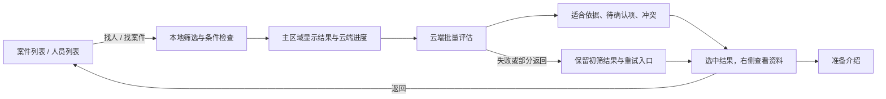

# HR 撮合工作台 v2：产品与交互设计

- 日期：2026-09-09
- 状态：核心业务路径已进入开发分支；自动化与构建已验证，实机验收进行中。本文仍包含目标设计，逐项交付状态以开发计划末尾记录为准。
- 开发分支：`codex/feature/hr-matching-workbench`
- 基线提交：`d36993f76431fe426bcb190ee0bb3883082911ca`，已推送至 `gridscale/feature/v1.0.0`。
- 配套文档：[开发计划与验收标准](../implementation/hr-matching-workbench-v2-plan.md)

## 1. 产品目标

将应用组织成 HR 每天使用的撮合工作台，优先完成两条业务：**有案件找人，有人员找案件**。AI 参与理解和比较业务条件；聊天是补充入口。

产品成效以操作成本衡量：从看到对象到开始匹配要点几次、是否需要反复切页、介绍前需要搬运多少信息。避免增加推广审批、人才库准入、字段确认等前置步骤。

### 1.1 已确定的设计原则

1. 导入后即可推广、找案件或参与案件找人；缺少非必填信息允许继续，但不能把缺失信息解释为满足条件。
2. 案件与人员拥有同等地位；两个匹配方向使用相同的布局、进度、结果说明与返回逻辑。
3. 列表展示当前业务对象；对象内部展示来源与变化历史。
4. 列表选中、详情对象、匹配来源与异步结果必须一致。
5. 右侧主要供阅读；“是否自社”允许下拉选择后自动保存，其余完整资料进入管理页修改。
6. 明确区分本地初筛与云端已评估，不把初筛排序包装成 AI 结论。
7. 复制、打开邮件、准备介绍均不代表已经发送或联系。
8. 简单动作直接执行；只有现有数据版本、记录有效性等必要校验，不增加业务确认门。

### 1.2 本次不扩展的业务

不建设工资、考勤、合同、复杂 CRM 漏斗、多人实时协作、自动群发。保留已有面试、管理和治理能力的入口，不在主界面完整铺开这些模块。不将向量召回升级、全量历史去重或新模型接入作为界面改造的前提。

## 2. 当前基线与目标差异

| 主题 | 基线中已有能力 | v2 的目标 |
|---|---|---|
| 主入口 | Agent 最新动态、固定聊天任务列、右侧业务面板 | 案件 / 人员业务列表为主，聊天与历史按需打开 |
| 匹配 | 两个方向已有本地筛选与云端批量评估 | 主区域展示匹配结果，统一过程与结果交互 |
| 列表 | 新建、资料更新、状态变化等动态条目 | 同一业务对象一张卡，变化进入对象历史 |
| 人员 | 导入即可业务使用；自社三态；右侧快捷保存 | 保留行为，优化列表信息层次 |
| 案件阅读 | 完整本机脱敏正文、段落与条目排版 | 保留完整正文，整合到统一资料区 |
| 介绍 | 人员模板、案件配信、复制和邮件交接 | 由当前案件—人员组合准备有针对性的介绍 |
| 跟进 | 已有提案、面试、跟进事件能力 | 用轻量入口记录真实业务动作，避免并行建设新系统 |

现有实现与历史验证分别见 [Agent 最新动态工作台](../implementation/agent-latest-workspace-v1.md)、[信息整理与推广工作区 v1](../implementation/business-workbench-v1.md)。历史测试结果不等同于 v2 验收结果。

## 3. 信息架构与页面框架

### 3.1 常驻区域

| 区域 | 内容 | 行为 |
|---|---|---|
| 左侧窄导航 | 案件、人员、跟进、Agent；底部设置 | 切换业务，不常驻聊天任务列表 |
| 中间主区域 | 案件列表、人员列表或当前匹配结果 | 筛选、搜索、选中、比较结果 |
| 右侧资料区 | 当前对象资料 | 阅读、补自社属性、进入完整管理页 |
| 工具入口 | 导入 / 粘贴、问 Agent | 按需打开，不长期挤占业务区域 |

聊天任务与历史放入按需打开的 Agent 面板，与资料共用右侧位置。不再设置笼统的“管理”菜单。完整案件资料和完整人员资料从各自列表或当前详情进入，面试日程从跟进页进入；二级页面保留同一侧栏和返回原业务列表的入口。模板仍从介绍的具体业务位置打开。Agent 只承载当前业务的对话与结果，不展示全局待办角标或“待处理事项”。跟进记录与面试安排从跟进页处理，导入失败在导入入口处理，介绍文案从具体人员或案件的“准备介绍”进入。普通导入资料不进入统一待审核队列。

### 3.2 页面示意

```text
┌────────┬──────────────────────────────┬─────────────────────────┐
│ 案件   │ 案件 / 人员列表              │ 当前选中对象             │
│ 人员   │ 搜索  筛选        导入 / 粘贴 │ 名称、关键条件、完整资料 │
│ 跟进   │                              │                         │
│        │ 对象卡片                     │ 自社：未设置 / 是 / 否   │
│        │ 关键条件 + 最近变化          │ 查看 / 编辑完整资料      │
│        │                   [找人]     │                         │
│ Agent  │                              │                         │
│ 设置   │                [问 Agent]    │                         │
└────────┴──────────────────────────────┴─────────────────────────┘
```

说明：人员卡片的主按钮为“找案件”；自社下拉框仅出现在人员资料中，正式文案使用“未设置 / 自社 / 非自社”。

### 3.3 启动与布局恢复

- 首次进入默认案件列表；以后恢复上次案件或人员工作位置，不额外展示欢迎页。
- 恢复业务页、筛选、搜索、选中 ID、滚动位置和右侧宽度。对象已删除时显示明确空态，不擅自选中另一对象。
- 应用重启只恢复阅读位置，不自动重放匹配、发送或写入动作。未持久化的匹配结果显示可重新匹配的状态。
- 原列表未选中对象时，右侧收起，让列表使用可用空间。
- 宽屏采用导航、业务内容、右侧资料 / Agent 三栏。右侧进入实际网格布局，打开时业务内容随可用宽度调整，不覆盖列表；资料与 Agent 同时只显示一个。
- 窗口宽度不超过 1000 像素时，资料或 Agent 使用单页；关闭后恢复原列表。历史只替换 Agent 内的对话内容，不从左侧额外覆盖业务区。窄窗口仍保留导航文字。
- 以 1440、1280、1024 像素窗口宽度做验收样本；导航约 64–80 像素，右侧默认约 400–480 像素，具体由实机阅读验证微调。

## 4. 案件与人员列表

### 4.1 卡片内容

| 案件卡片 | 人员卡片 |
|---|---|
| 案件名称 | 本机显示名与必要的资料区分信息 |
| 必须技能、预算、地点 / 出勤、开始时间 | 核心技能、经验、单价、可入场时间、自社属性 |
| 最近收到或业务更新的时间、变化提示 | 最近资料更新、变化提示 |
| 主按钮“找人” | 主按钮“找案件” |

点击卡片主体打开资料。卡片底部直接展示“查看详情”“找人 / 找案件”“准备介绍”“稍后处理”四个操作，不使用省略号菜单隐藏常用入口。匹配按钮保持主操作样式；空间不足时按钮自然换行。

案件和人员导入后直接进入业务列表，不设置“可匹配”分类或额外资格筛选。阅读筛选仅保留“全部 / 未读 / 稍后处理”，默认全部。

时间下拉框保留“今天 / 最近 7 天 / 最近 30 天 / 全部时间”；案件默认今天，人员默认全部时间。按最近业务更新时间和本机日历日筛选，最近 7 天包含今天及前 6 天。列表按实际时间从新到旧排列，卡片时间显示到分钟。案件与人员分别保留后续手动选择的筛选。超过 20 条时按每页 20 条分页，底部显示条目范围、当前页 / 总页数、上一页 / 下一页。切换筛选或搜索回到第一页；打开详情、匹配返回及切换业务列表保留各自页码和滚动位置。

卡片只展示少量关键条件；超长技能折叠为“另 N 项”。关键缺失项显示“未填写”，不把所有空字段堆在卡片上。标签区分来源、更新与业务可用性，不显示技术处理状态。

### 4.2 对象与动态

- 同一案件 ID 或人员档案 ID 的多次变化聚合为一条当前对象记录。
- “最近变化”由业务资料更新时间决定；阅读、复制、打开详情不改变业务更新时间和排序。
- 选中对象或标为已读不立即移动卡片。新数据到达时提示更新，由 HR 刷新后应用新排序。
- 已读绑定对象及资料版本；新版本可再次显示未读。“稍后处理”绑定对象，不作为业务完成或匹配资格。
- 对象详情内保留来源和变化历史，允许判断条件何时被更新。

### 4.3 身份与去重边界

第一阶段仅聚合同一稳定 ID 的动态，不按姓名或相似标题自动合并档案。

相同邮件标识、明确的来源关联或已有导入幂等键可以复用；同一邮件线程也不必然是同一个案件。不同来源的相似记录仍分别保留。后续如提供重复建议，应由 HR 主动确认，保留来源和可恢复的关联，不作为匹配的阻断步骤。

## 5. 双向匹配

### 5.1 统一流程



### 5.2 匹配页布局

- 中间顶部是紧凑来源摘要：名称及关键要求，不重复展示完整案件或履历。
- 中间主体为匹配结果；按本地 / 云端状态展示进度与适合依据。
- 右侧默认显示来源资料；选中结果后显示目标资料。点击顶部来源名称可重新查看来源。
- 当前来源对象与当前结果对象分别保存，不用一个 selected ID 兼任两者。
- “返回案件列表 / 返回人员列表”恢复原列表、选中和滚动；从结果详情返回不重新调用 AI。
- 同一组结果里的对象切换只做本地读取。

### 5.3 每条结果应回答的问题

1. **适合依据**：指向具体技能、项目经历或案件要求。
2. **待确认项**：资料未说明或证据不足，明确标为未知。
3. **明确冲突**：条件不相容，说明冲突双方。

优先展示依据，不突出容易造成过度信任的精确总分。本地结果标“本地初筛”；只有有效云端结果标“AI 已评估”。模型只返回部分对象时，逐条标记覆盖范围。

核心技术已有依据、但单价、入场、通勤、沟通能力等条件尚未确认的组合，在“条件待沟通”区域直接展示，不计入 AI 推荐数。每条都提供“记录联系”“查看资料”“准备介绍”，HR 可按判断分别推进一个或多个组合，无需额外的确认或审批状态。缺少必需技术证据或存在明确硬条件冲突的组合仍排除。

“还需沟通”按条目显示，并带入当前组合的介绍窗口及首次跟进表单的下一步安排。介绍草稿按人员、案件、双方版本、语言及模板分别保留；AI 重新生成或人工编辑文案时，待沟通提示仍可见。准备介绍和打开跟进表单不会创建联系记录，只有保存跟进才产生业务记录，不把人工推进改写为 AI 已确认满足。

### 5.4 硬条件与自社

| 人员自社值 | 普通案件 | 明确要求自社的案件 |
|---|---|---|
| 自社 `true` | 按其他条件匹配 | 通过自社条件 |
| 非自社 `false` | 按其他条件匹配 | 排除 |
| 未设置 `null` | 按其他条件匹配 | 排除，但保持空值 |

“自社优先”“自社サービス”等不应被解释为自社限定；存在否定或明确允许外部人员时按已有规则识别。自社排除在云端评估前执行，AI 不得放宽。必要时展示数量说明和人员列表筛选入口，不要求 HR 一次补齐所有人。

其他硬条件保持已有字段各自的通过 / 冲突 / 未知规则；不把所有未知条件一律判为失败。已归档、删除、明确已入场或暂停的记录按现有业务可用性规则处理。

### 5.5 请求与结果有效性

- 点击匹配后立即禁用所有同一请求入口，包括列表、右侧和 Agent 快捷入口；连续点击不新增请求、不排队重放。
- 首轮沿用已有本地筛选与有限数量的云端评估。当前实现的上限和超时属于配置与技术策略，不作为产品宣传承诺。
- 云端失败保留初筛结果，显示失败与重试。取消意味着停止后续处理并在可行时中止网络请求，不显示为完成。
- 切换页面不偷偷重启请求。当前轮仍执行时可返回查看；迟到回复只归属原来源。
- 人员或案件版本变化后旧评估失效；界面显示“资料已更新，需重新匹配”，保留位置但不继续使用旧结论准备针对性介绍。

## 6. 资料阅读与修改

### 6.1 案件

名称与简洁编辑入口在顶部，关键条件在其下，完整脱敏正文默认展示。正文保留原文段落、条目和明确标题；不依赖列表预览，不截断长案件，不自行改写要求。全部结构化字段与来源历史按需展开。

### 6.2 人员

先展示自社、单价、可入场、工作方式、核心技能等业务条件，再展示项目经历。近期经历优先展开或展示摘要，其余可展开；不得删除原项目内容。

“是否自社”放在基本条件首行，一行放下标签和下拉框。选择即保存，保存期间禁用，成功就地反馈，失败保留原值。资料版本同时更新；其他完整字段进入传统人员管理页修改。

### 6.3 Agent 面板

从当前来源、选中目标或匹配结果发起提问。面板顶部显示本次对象范围；历史在面板内切换。打开具体资料时使用同一右侧位置显示资料，关闭 Agent 后恢复先前资料。聊天输入区不重复展示业务匹配与介绍按钮，主操作留在业务列表和资料区。

聊天不会隐式改变匹配来源或执行外部发送。关闭面板保留会话内草稿；跨重启恢复草稿必须通过已有加密存储能力实现，不把正文写进普通 UI 偏好。Escape 优先返回对话，再关闭 Agent，不连带关闭当前隐藏的资料。

## 7. 准备介绍

| 入口 | 默认产物 |
|---|---|
| 单个人员资料 | 通用人员介绍 |
| 单个案件资料 | 通用案件介绍 |
| 案件—人员匹配结果 | 针对该案件突出该人员相关经验的介绍 |

准备介绍在独立抽屉或页面完成：一份草稿、两组直接展示的 Tab（中文 / 日文、标准 / 省略）、复制与打开邮件操作，不使用模板和语言下拉框。已有自定义模板也作为 Tab 保留。原资料区不变成编辑表单。缺少信息不编造，待确认项保留明确措辞。人员版本复用已有详细与短文模板；案件省略版仅移除结尾寒暄和多余空行，保留标准版的所有案件条件，不增加云端请求。

首轮针对性介绍可从已验证的匹配依据和现有模板组合生成，不为了改写文风自动追加云端调用。HR 可以编辑草稿；自动生成内容不得覆盖 HR 已编辑的草稿。模板或语言切换保留各自草稿，不丢失输入。

草稿绑定来源、目标及资料版本。资料变更时保留编辑文本并提示刷新依据，发送交接前继续执行当前版本与脱敏校验。默认匿名介绍，姓名和联系方式遵循现有本机边界。

复制成功记录“已复制”；打开邮件记录“已打开邮件”。收件人与最终发送仍由 HR 在邮件客户端完成，应用不推断发送成功。

## 8. 轻量跟进

复用已有提案和跟进关系，以案件—人员组合为业务上下文。允许 HR 记录“已联系，等待回复”及简短备注、下一步；面试安排链接现有面试记录。

自动记录只描述已经发生且系统可观察的动作：完成匹配、准备介绍、复制、打开邮件。已联系、收到回复等事实由 HR 明确记录。无需维护复杂漏斗，不给每个导入对象强制创建跟进任务。

跟进导航在可完成“记录—查看—回到对应案件 / 人员”的闭环后上线。自动提醒与定时追踪不属于本轮默认范围。

### 跟进页面的信息层次（2026-09-09）

以 HR 接着上次沟通继续做业务为目标。宽窗口采用“左侧选择人员—案件组合，右侧查看下一步和沟通历史”的布局，沿用现有业务页的配色与直接展示操作。

- 顶部以进行中、已联系、已回复、面试沟通中、已结束、全部筛选，并显示各阶段数量。进行中是未结束记录的视图，不是新增业务状态；默认不按今天过滤，避免遗漏跨日推进的联系。
- 左侧支持搜索人员、案件、最新沟通及下一步；按照更新时间倒序，每页 12 条。卡片只读，完整展示人员、案件、当前阶段及下一步，选中状态独立于右侧操作。
- 右侧固定展示关联人员和案件、查看案件、查看人员及记录新进展。处于面试沟通中时直接提供现有面试记录入口。下一步使用独立提示区，沟通记录按最新在前排列为时间线，保留每次的状态、时间、备注和当时的下一步。
- 记录新进展使用可直接选择的阶段选项。本次沟通默认留空，沿用待办内容，避免把上一条备注再次保存为新沟通。明确保存才追加事件；提交期间锁定操作，失败保留原稿和修订号，切换组合时按组合暂存草稿，取消清除该组合草稿。
- 在可用宽度不足 800px 时改为列表和单条详情切换，提供返回列表按钮，避免与案件资料或 Agent 同时显示时挤出多列。空列表直接提供案件找人和人员找案件入口；筛选无结果可以返回全部记录。

本次沿用现有跟进存储，不新增人员推广状态、数据库字段、自动发信或定时提醒。下一步中的日期仍为 HR 的文本备注。

## 9. 操作与视觉规范

- 一张卡突出一个主业务按钮，四个常用操作直接展示；点击主体也可查看详情。
- 页面上的主色用于关键行动；普通编辑和跳转使用简洁文本入口。
- 正文以可读字号、自然换行和明确段落组织；禁止用超长单段、小字号堆满右侧。
- 选中态、鼠标悬停态、忙碌态有区别；选中不能只依赖颜色。
- 键盘可进入卡片、菜单和详情；抽屉关闭后焦点回到发起入口。
- 所有业务文案提供中文与日文；接口名称、模型内部标识、数据库状态不直接作为 HR 文案。
- 缺失信息、无结果、加载失败与记录删除各有明确空态。

## 10. 场景验收与目标

以下为目标，尚未测量达成；云端耗时单独记录，不混入交互点击数。

| 场景 | 验收目标 |
|---|---|
| 列表开始匹配 | 已看到目标卡片时 1 次点击启动 |
| 查看匹配对象 | 1 次点击在右侧查看；不启动新匹配 |
| 回到来源列表 | 1 次返回恢复筛选、选中和滚动 |
| 修改自社 | 选择一次后保存，无额外保存按钮 |
| 通用推广 | 资料中进入准备介绍后即可编辑、复制 |
| 针对性介绍 | 从结果进入时自动带入当前组合，无需再次挑选双方 |
| 重复点击 | 同一轮匹配只有一个有效 Main 请求与受控云端批次 |
| 切换资料 | 不出现其他人员 / 案件的迟到结果 |
| 长案件 | 展示正文末尾，保留换行，横向无溢出 |
| 导入可用性 | 正常导入后可直接匹配和推广，无新增业务审批 |

首轮使用虚构案例完成两个方向和失败场景，再进行受控业务验收。评估匹配质量需要有参考判断的数据集；界面测试通过不代表召回率或推荐准确率已达标。

## 2026-09-09：人员邮件、直接编辑与对象会话

本轮以 HR 最新要求为准，覆盖此前右侧只读的约定。

- Gmail 人员邮件自动建档。PDF、DOCX、XLSX、XLS、XLSB 附件复用本地简历解析、OCR、脱敏和加密文件库。每个附件独立导入，邮件／附件台账支持去重和失败重试；有简历附件时，邮件正文不额外生成一个重复人员。无附件的人员消息按正文业务记录拆分建档。不支持的附件格式和失败数在 Gmail 同步区域显示。
- 案件、人员列表只展示数据和操作入口，名称、技能、条件、自社属性均不可在列表中编辑。右侧详情和完整档案的业务字段支持点选编辑，离开输入框自动保存。保留待保存输入；保存失败可重试。不同字段允许合并并发更改，同一字段发生冲突时保留输入并要求核对。原始邮件、原始附件、历史版本和 AI 匹配证据保持为来源／历史记录，不直接重写；业务字段的更改产生新版本，并使旧匹配结果失效。
- 人员及案件的准备介绍窗口保留中文／日文、标准／省略 Tabs，增加 AI 重新生成。调用现有云端脱敏通道，生成期间锁定操作，失败保留旧文案，资料版本改变时拒绝覆盖。
- 人员向某个案件准备介绍时，打开系统默认邮件客户端，优先带入该案件原邮件 Reply-To；没有时用 From。只接受单一有效邮箱，案件邮箱在 Main 从加密本地记录解析，不进入 AI 提示词。用户在邮件客户端核对后发送。
- Agent 会话以案件 review ID 或人员 document ID 关联，与资料版本独立。问 Agent 只打开该对象的会话；会话管理支持新建、切换和删除。新建空会话即持久化，切换对象时不会混入旧历史或迟到的 AI 回答。永久删除业务对象时，一并清理其关联会话。

Schema 48 增加本地 Gmail 附件导入台账与回复地址；保留 Gmail read-only 权限，附件读取使用官方 GET 接口：[Gmail attachments.get](https://developers.google.com/workspace/gmail/api/reference/rest/v1/users.messages.attachments/get)。

本轮补充约定：邮件分类优先识别“介绍人员 / 募集人员”的业务方向，不以单价、可入场时间单独决定方向。包含简历附件时，每份附件建立自己的人员记录，封面正文不会额外创建一名人员，也不会把未明确归属的条件自动填写到每份简历。旧案件的回复地址可以在打开邮件时按需读取。对象会话的新建入口立即保存一个与当前对象关联的空会话，首次消息继续写入同一会话。
